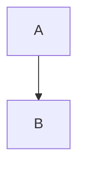

# Comparativa «Antes y después» Implementation Plan

> **For agentic workers:** REQUIRED SUB-SKILL: Use superpowers:subagent-driven-development (recommended) or superpowers:executing-plans to implement this plan task-by-task. Steps use checkbox (`- [ ]`) syntax for tracking.

**Goal:** Una vista por trámite que compare el AS-IS con el TO-BE —métricas, requisitos, pasos, gráfica con el porcentaje de simplificación y veredicto— con un documento descargable, para uso interno de Simplificación.

**Architecture:** Dos extractores nuevos leen el texto del AS-IS y la prosa del TO-BE; una función pura (`comparativa.armar.comparar`) los cruza con el manifiesto y devuelve una `Comparativa` ya contada. La API la sirve como JSON y como HTML descargable; la SPA solo pinta lo que recibe. Dependencia en un sentido: `web` → `comparativa` → `extractores` → `nucleo`.

**Tech Stack:** Python 3.9+, dataclasses, FastAPI, pytest · React + TypeScript + Tailwind v4 + shadcn/ui, vitest + Testing Library.

**Spec:** `docs/superpowers/specs/2026-09-28-comparativa-antes-despues-design.md`

## Global Constraints

- Python 3.9: `Optional[X]`, nunca `X | None`.
- Identificadores y módulos en español sin acentos; los textos al usuario sí llevan acentos.
- Los comentarios explican por qué, no qué.
- Nada de `comparativa/` ni de `extractores/` importa de `agentes`, `web`, `cli` ni `compilador`.
- Ningún modelo de IA interviene. Ninguna prueba toca la red.
- Nada se infiere: un valor es `contado`, `leido`, `declarado` o `sin_dato`. No se convierten unidades.
- Todos los huecos `CMP-*` son `por_confirmar` y viven solo en la comparativa: no se escriben en `huecos.json` ni entran a `bloquean`.
- En la SPA no hay `<table>`: una `Card` por elemento; las pruebas buscan por `article`/`aria-label`.
- Sin librería de gráficas ni CDN: SVG y CSS propios con la rampa `--viz-*`.
- Todo dato del expediente que entra al HTML descargable pasa por `html.escape`.
- La comparativa no toca el manifiesto ni el `.gpm`.
- Los archivos de referencia se leen, nunca se modifican. No se modifica `CLAUDE.md` sin aprobación de Daniel.
- No se relaja ninguna aserción existente. La suite pasa antes de cada commit: `.venv/bin/pytest -q` y `bash scripts/check-frontend.sh`.
- Commits terminan con `Co-Authored-By: Claude Fable 5.1 <noreply@anthropic.com>`.

## Review Focus

1. **AS-IS con dos listas de pasos o pasos con sub-listas** (Prórroga: «dos mediciones distintas»). Se espera que se cuente solo el primer nivel de la primera lista y que la persona pueda corregir la cifra declarándola. Prueba en Task 1 y Task 3.
2. **Valor declarado con texto alrededor** («2 visitas», «24 horas» contra «13 días hábiles»). Se espera que solo se calcule porcentaje con la misma unidad en los dos lados y que lo demás se enseñe tal cual. Prueba en Task 3.
3. **Antes igual a cero** (0 visitas antes, 0 después). Se espera que no haya división entre cero ni porcentaje. Prueba en Task 3.
4. **AS-IS sin la forma del equipo o sesión sin AS-IS** (Periódico Oficial homologado; expediente cargado solo con Diccionario y TO-BE). Se espera una comparativa con huecos o `disponible: false`, nunca una excepción ni ceros pintados. Prueba en Task 1 y Task 5.
5. **Texto hostil en un requisito o en una métrica declarada** (`<script>`, `</svg>`). Se espera que el documento lo enseñe como texto. Prueba en Task 4 y Task 5.

---

## Estructura de archivos

| Archivo | Responsabilidad |
| --- | --- |
| `src/gpmc/extractores/as_is.py` (nuevo) | Texto del AS-IS → `EstadoActual`. También aloja `requisitos_del_as_is` y `casa`, mudados de `agentes`. |
| `src/gpmc/extractores/rediseno.py` (nuevo) | Prosa del TO-BE → `Rediseno` (cambios, eliminaciones, impacto, métricas declaradas). |
| `src/gpmc/comparativa/__init__.py`, `armar.py` (nuevos) | `comparar(...) -> Comparativa`. Función pura. |
| `src/gpmc/comparativa/documento.py` (nuevo) | `Comparativa` → HTML autocontenido con la gráfica en SVG. |
| `src/gpmc/web/api_comparativa.py` (nuevo) | Router con los tres endpoints. |
| `src/gpmc/web/sesiones.py` (modificar) | `comparativa_de` / `escribir_comparativa`. |
| `src/gpmc/web/app.py` (modificar) | Incluir el router. |
| `src/gpmc/agentes/verificar_fase3.py` (modificar) | Importar lo mudado. |
| `src/gpmc/web/plantilla-tobe.md` (modificar) | Sección opcional «Métricas del rediseño». |
| `frontend/src/lib/types.ts`, `api.ts`, `rutas.ts` (modificar) | Tipos, cliente y ruta `/revisar/{sid}/comparativa`. |
| `frontend/src/features/comparativa/` (nuevo) | `formato.ts`, `GraficaSimplificacion.tsx`, `CapturaMetrica.tsx`, `Comparativa.tsx` y sus pruebas. |
| `frontend/src/features/huecos/RielEntrega.tsx`, `frontend/src/App.tsx` (modificar) | Puerta de entrada y montaje. |

---

### Task 1: Extractor del AS-IS y mudanza del lector de requisitos

**Files:**
- Create: `src/gpmc/extractores/as_is.py`
- Modify: `src/gpmc/agentes/verificar_fase3.py:24-85`
- Test: `tests/test_as_is.py`

**Interfaces:**
- Consumes: `gpmc.planeacion.registro.clave(nombre: str) -> str`.
- Produces:
  - `EstadoActual` (dataclass): `canal: str`, `pasos: list`, `requisitos: list`, `tiempo: str`, `costo: str`, `sistemas: list`, `fricciones: list` (listas de `str`).
  - `extraer(texto: str) -> EstadoActual`
  - `requisitos_del_as_is(as_is: str) -> list`
  - `casa(requisito: str, etiqueta: str) -> bool`
  - `titulo_de(item: str) -> str`
  - `PUNTO` (regex compilada de un ítem de lista, con o sin número)

- [ ] **Step 1: Escribir las pruebas que fallan**

```python
# tests/test_as_is.py
from gpmc.extractores.as_is import casa, extraer, requisitos_del_as_is, titulo_de

_ANIDADO = """# Análisis AS-IS — Alta de Avisos

## Estado actual (según fuentes)
- **Canal:** Presencial (Oficialía de Partes), con procesamiento interno.
- **Pasos / ventanillas (3 pasos documentados en el manual):**
  1. El Notario entrega el formato.
  2. Oficialía genera el F7.
     - detalle que no es un paso
  3. El Notario paga en ventanilla.
- **Tiempo estimado:** 13 días hábiles, confirmado con la dependencia (2026-07-20).
- **Requisitos:** identificación oficial vigente, tarjeta de circulación y solicitud
- **Costo:** $534.00 MXN
- **Sistemas involucrados:** e-SIT (orden de pago F7), Drive/Excel ("uno" y "dos"), Word.

## Fricciones identificadas
1. **Doble transcripción del mismo dato.** Se vuelve a escribir en cuatro sistemas.
2. Sin folio de seguimiento.

## Otra sección
1. Esto no es una fricción.
"""

_EN_LINEA = ("- **Pasos / ventanillas:** 3 etapas — Recepción de Solicitud (5 min) → "
             "Revisión Documental (2 min) → Entrega.\n")


def test_lee_los_pasos_de_una_lista_anidada_solo_el_primer_nivel():
    assert extraer(_ANIDADO).pasos == [
        "El Notario entrega el formato",
        "Oficialía genera el F7",
        "El Notario paga en ventanilla",
    ]


def test_lee_los_pasos_en_la_misma_linea_separados_por_flecha():
    assert extraer(_EN_LINEA).pasos == [
        "Recepción de Solicitud (5 min)", "Revisión Documental (2 min)", "Entrega"]


def test_con_dos_listas_de_pasos_se_queda_con_la_primera():
    texto = ("- **Pasos y tiempos — dos mediciones:**\n  - Medición del manual\n"
             "- **Pasos (según la ficha):**\n  1. Uno\n  2. Dos\n")
    assert extraer(texto).pasos == ["Medición del manual"]


def test_tiempo_canal_costo_y_sistemas():
    e = extraer(_ANIDADO)
    assert e.tiempo == "13 días hábiles"
    assert e.canal.startswith("Presencial")
    assert e.costo == "$534.00 MXN"
    assert e.sistemas == ["e-SIT", "Drive/Excel", "Word"]


def test_tiempo_de_respuesta_sin_vineta_tambien_se_lee():
    assert extraer("**Tiempo de respuesta:** 3 días hábiles\n").tiempo == "3 días hábiles"


def test_fricciones_solo_de_su_seccion_y_con_el_titulo_en_negrita():
    assert extraer(_ANIDADO).fricciones == [
        "Doble transcripción del mismo dato", "Sin folio de seguimiento"]


def test_requisitos_van_en_el_estado_actual():
    assert extraer(_ANIDADO).requisitos == [
        "identificación oficial vigente", "tarjeta de circulación", "solicitud"]
    assert requisitos_del_as_is(_ANIDADO) == extraer(_ANIDADO).requisitos


def test_un_as_is_sin_forma_devuelve_vacio_sin_excepcion():
    for texto in ("", None, "# Título\n\nProsa sin viñetas.\n", "| a | b |\n|---|---|\n"):
        e = extraer(texto)
        assert e.pasos == [] and e.requisitos == [] and e.tiempo == ""
        assert e.sistemas == [] and e.fricciones == []


def test_casa_por_inclusion_sin_acentos_ni_mayusculas():
    assert casa("identificación oficial", "Documento: Identificación Oficial Vigente")
    assert not casa("acta de nacimiento", "Comprobante de pago")
    assert not casa("", "algo")


def test_titulo_de_prefiere_la_negrita_inicial():
    assert titulo_de("**Captura a distancia**, sin ventanilla.") == "Captura a distancia"
    assert titulo_de("Sin negrita.") == "Sin negrita"


def test_verificar_fase3_sigue_exportando_el_lector():
    from gpmc.agentes.verificar_fase3 import requisitos_del_as_is as viejo
    assert viejo is requisitos_del_as_is
```

- [ ] **Step 2: Correr y ver que fallan**

Run: `.venv/bin/pytest tests/test_as_is.py -q`
Expected: FAIL con `ModuleNotFoundError: No module named 'gpmc.extractores.as_is'`

- [ ] **Step 3: Escribir `src/gpmc/extractores/as_is.py`**

```python
"""Lee el Analisis AS-IS como datos: pasos, requisitos, tiempo, sistemas y fricciones.

Hasta el 2026-09-28 del AS-IS solo se sacaban metadatos y requisitos. La
comparativa de antes y despues necesita el resto. La forma es la medida sobre
los seis expedientes del equipo de Simplificacion: viñetas `- **Nombre:** valor`
bajo «Estado actual», con los pasos anidados o en la misma linea con `→`.

Es tolerante a proposito: lo que no se lee queda vacio y la comparativa lo
reporta como «sin dato». Fallar hacia vacio no produce cifras falsas.
"""
import re
from dataclasses import dataclass, field

from gpmc.planeacion.registro import clave

# Las formas medidas en la boveda de Simplificacion (2026-09-24): `**Requisitos:**`,
# `**Requisitos documentales:**`, `**Requisitos (ficha RUTS):**`... con la lista
# en la misma linea o en items anidados debajo. Un AS-IS puede traer mas de una
# lista de requisitos; se suman todas.
_LINEA_REQ = re.compile(r"^\s*[-*]?\s*\*\*Requisitos[^*]*\*\*:?\s*(.*)$", re.I)
_ITEM = re.compile(r"^\s+[-*]\s+(.*)$")
_VINETA = re.compile(r"^\s*[-*]?\s*\*\*([^*]+?)\*\*:?\s*(.*)$")
_HIJO = re.compile(r"^(\s+)(?:[-*]|\d+[.)])\s+(.*)$")
PUNTO = re.compile(r"^\s*(?:[-*]|\d+[.)])\s+(.*)$")
_SECCION_FRICCION = re.compile(r"^##+\s+Fricci[oó]n", re.I)
_NEGRITA_INICIAL = re.compile(r"^\*\*(.+?)\*\*")
_RAYA = re.compile(r"\s+[—–]\s+")
# Tras el dato viene la nota del analista: «13 dias habiles, confirmado con…».
_CORTE = re.compile(r"\s+[—–]\s+|[,;(]")


@dataclass
class EstadoActual:
    canal: str = ""
    pasos: list = field(default_factory=list)
    requisitos: list = field(default_factory=list)
    tiempo: str = ""
    costo: str = ""
    sistemas: list = field(default_factory=list)
    fricciones: list = field(default_factory=list)


def _limpio(item: str) -> str:
    # Hasta la raya o el parentesis: lo que sigue es nota del analista.
    t = re.split(r"\s+[—–-]\s+|\s*\(", item, maxsplit=1)[0]
    return t.strip().rstrip(".").strip()


def _enumeracion(texto: str) -> list:
    """«a, b y c» -> [a, b, c]. Lo que va entre parentesis es nota y se quita
    antes de partir: «Identificacion oficial (INE, pasaporte o cartilla)» es
    UN requisito. La «y» solo separa en el ultimo tramo: «pago de derechos y
    aprovechamientos» sin comas es un solo requisito."""
    sin_notas = re.sub(r"\([^()]*\)", "", texto)
    partes = [p for p in sin_notas.split(",")]
    if len(partes) > 1:
        # «a, b, y c»: la coma antes de la «y» deja el ultimo tramo como «y c».
        ultimo = re.sub(r"^\s*y\s+", "", partes[-1])
        partes = partes[:-1] + re.split(r"\s+y\s+", ultimo.strip(), maxsplit=1)
    return partes


def requisitos_del_as_is(as_is: str) -> list:
    """Las listas de requisitos del AS-IS, en la misma linea o anidadas debajo
    (solo el primer nivel: un sub-item es un detalle del requisito). No se
    leen, a proposito, listas sin sangria, separadas por una linea en blanco o
    numeradas: fallar hacia «no hay requisitos» no produce GEN-01 falsos."""
    lineas = (as_is or "").splitlines()
    salida = []
    for i, linea in enumerate(lineas):
        m = _LINEA_REQ.match(linea)
        if not m:
            continue
        resto = m.group(1).strip()
        if resto:
            salida += [r for r in (_limpio(p) for p in _enumeracion(resto)) if r]
            continue
        sangria = None
        for sig in lineas[i + 1:]:
            mi = _ITEM.match(sig)
            if not mi:
                break
            nivel = len(sig) - len(sig.lstrip())
            if sangria is None:
                sangria = nivel
            if nivel > sangria:
                continue
            r = _limpio(mi.group(1))
            if r:
                salida.append(r)
    return salida


def casa(requisito: str, etiqueta: str) -> bool:
    a, b = clave(requisito), clave(etiqueta)
    return bool(a) and bool(b) and (a in b or b in a)


def titulo_de(item: str) -> str:
    """El titulo en negrita con que el equipo abre un punto; sin negrita, el
    punto entero. Se quita el punto final, que es de la frase y no del titulo."""
    t = (item or "").strip()
    m = _NEGRITA_INICIAL.match(t)
    if m:
        t = m.group(1)
    return t.strip().rstrip(".:").strip()


def _sin_parentesis(texto: str) -> str:
    previo = None
    while previo != texto:
        previo, texto = texto, re.sub(r"\([^()]*\)", "", texto)
    return texto


def _vineta(lineas: list, prefijos: tuple) -> tuple:
    """(resto, hijos) de la PRIMERA viñeta cuyo nombre empieza por `prefijos`.
    La primera y no todas: Prorroga trae dos mediciones de pasos de dos fuentes
    y sumarlas daria una cifra que nadie escribio."""
    for i, linea in enumerate(lineas):
        m = _VINETA.match(linea)
        if not m or not clave(m.group(1)).startswith(prefijos):
            continue
        hijos, sangria = [], None
        for sig in lineas[i + 1:]:
            mh = _HIJO.match(sig)
            if not mh:
                break
            nivel = len(mh.group(1))
            if sangria is None:
                sangria = nivel
            if nivel > sangria:
                continue
            hijos.append(mh.group(2).strip())
        return m.group(2).strip(), hijos
    return "", []


def _sin_punto(texto: str) -> str:
    return texto.strip().rstrip(".").strip()


def _pasos(lineas: list) -> list:
    resto, hijos = _vineta(lineas, ("pasos",))
    if hijos:
        return [p for p in (_sin_punto(h) for h in hijos) if p]
    if "→" not in resto:
        return []
    tramos = resto.split("→")
    # «7 etapas — Recepcion → …»: lo de antes de la raya es la cuenta, no un paso.
    tramos[0] = _RAYA.split(tramos[0])[-1]
    return [p for p in (_sin_punto(t) for t in tramos) if p]


def _dato(lineas: list, prefijos: tuple) -> str:
    resto, _ = _vineta(lineas, prefijos)
    return _sin_punto(_CORTE.split(resto, maxsplit=1)[0]) if resto else ""


def _sistemas(lineas: list) -> list:
    resto, _ = _vineta(lineas, ("sistemas",))
    return [s for s in (_sin_punto(p) for p in _sin_parentesis(resto).split(",")) if s]


def _fricciones(lineas: list) -> list:
    salida, dentro = [], False
    for linea in lineas:
        if linea.startswith("#"):
            dentro = bool(_SECCION_FRICCION.match(linea))
            continue
        if not dentro or linea[:1].isspace():
            continue
        m = PUNTO.match(linea)
        if m:
            salida.append(titulo_de(m.group(1)))
    return [f for f in salida if f]


def extraer(texto: str) -> EstadoActual:
    lineas = (texto or "").splitlines()
    resto_canal, _ = _vineta(lineas, ("canal",))
    resto_costo, _ = _vineta(lineas, ("costo",))
    return EstadoActual(
        canal=_sin_punto(resto_canal),
        pasos=_pasos(lineas),
        requisitos=requisitos_del_as_is(texto),
        tiempo=_dato(lineas, ("tiempo",)),
        costo=_sin_punto(resto_costo),
        sistemas=_sistemas(lineas),
        fricciones=_fricciones(lineas),
    )
```

- [ ] **Step 4: Apuntar `verificar_fase3.py` a lo mudado**

En `src/gpmc/agentes/verificar_fase3.py`: borrar las definiciones de `_LINEA_REQ`, `_ITEM`, `_limpio`, `_enumeracion`, `requisitos_del_as_is` y `_casa`, junto con el comentario «Las formas medidas en la boveda…» que las precede (los comentarios de `_CICLO_EN_AS_IS` y `_RAMA_CORRECCION` se quedan). Borrar también `from gpmc.planeacion.registro import clave` si `clave` ya no se usa en el archivo (comprobar con `grep -n "clave(" src/gpmc/agentes/verificar_fase3.py`). Añadir, junto a los demás imports de `gpmc.extractores`:

```python
# El lector de requisitos se mudo a `extractores/as_is.py` el 2026-09-28: lo usa
# tambien la comparativa, que no puede importar de `agentes`.
from gpmc.extractores.as_is import casa as _casa, requisitos_del_as_is
```

- [ ] **Step 5: Correr las pruebas nuevas y las de la Fase 3**

Run: `.venv/bin/pytest tests/test_as_is.py tests/test_fase3.py -q`
Expected: PASS, sin ninguna aserción de `test_fase3.py` modificada.

- [ ] **Step 6: Suite completa y commit**

Run: `.venv/bin/pytest -q`
Expected: PASS

```bash
git add src/gpmc/extractores/as_is.py src/gpmc/agentes/verificar_fase3.py tests/test_as_is.py
git commit -m "feat(extractores): el AS-IS se lee como datos; el lector de requisitos se muda de agentes"
```

---

### Task 2: Extractor de la prosa del TO-BE

**Files:**
- Create: `src/gpmc/extractores/rediseno.py`
- Test: `tests/test_rediseno.py`

**Interfaces:**
- Consumes: `gpmc.extractores.as_is.PUNTO`, `titulo_de(item: str) -> str`.
- Produces:
  - `Punto` (dataclass): `titulo: str`, `texto: str`.
  - `Rediseno` (dataclass): `cambios: list` (de `Punto`), `eliminaciones: list` (de `Punto`), `impacto: list` (de `Punto`), `declaradas: list` (de tuplas `(nombre: str, antes: str, despues: str)`).
  - `extraer(texto: str) -> Rediseno`

- [ ] **Step 1: Escribir las pruebas que fallan**

```python
# tests/test_rediseno.py
from gpmc.extractores.rediseno import extraer

_TOBE = """# Propuesta TO-BE — Alta de Avisos

## Propuesta

### Principio aplicado: eliminar, no solo digitalizar
Antes de automatizar cada paso se evaluó si puede eliminarse.

- **El Excel para oficios se elimina por completo**: el oficio sale de la plantilla.

- **La orden de trabajo llenada a mano se elimina**: la sustituye la solicitud.

**Diagrama 1 de 2:**



**Cambios concretos frente al AS-IS:**
1. **Captura 100% a distancia**, sin depender de Oficialía.
   - detalle que no cuenta
2. Monto calculado por el Sistema.
3. **Dirección General eliminada del flujo por completo** (confirmado).

## Impacto estimado
> Estimación cualitativa del agente, no un dato medido.

- **Elimina cualquier traslado físico del Notario.**
- Abre la puerta a procesar avisos de forma individual.

## Métricas del rediseño

| Métrica | Antes | Después |
| --- | --- | --- |
| Tiempo de respuesta | 13 días hábiles | 3 días hábiles |
| Visitas presenciales | 2 | 0 |

## Riesgos
- Esto no es impacto.
"""


def test_cambios_concretos_solo_el_primer_nivel():
    r = extraer(_TOBE)
    assert [p.titulo for p in r.cambios] == [
        "Captura 100% a distancia",
        "Monto calculado por el Sistema",
        "Dirección General eliminada del flujo por completo",
    ]
    assert "sin depender de Oficialía" in r.cambios[0].texto


def test_eliminaciones_juntan_el_principio_y_los_cambios_que_eliminan():
    r = extraer(_TOBE)
    assert [p.titulo for p in r.eliminaciones] == [
        "El Excel para oficios se elimina por completo",
        "La orden de trabajo llenada a mano se elimina",
        "Dirección General eliminada del flujo por completo",
    ]


def test_impacto_no_se_traga_la_seccion_siguiente():
    assert [p.titulo for p in extraer(_TOBE).impacto] == [
        "Elimina cualquier traslado físico del Notario",
        "Abre la puerta a procesar avisos de forma individual",
    ]


def test_metricas_declaradas_sin_encabezado_ni_separador():
    assert extraer(_TOBE).declaradas == [
        ("Tiempo de respuesta", "13 días hábiles", "3 días hábiles"),
        ("Visitas presenciales", "2", "0"),
    ]


def test_un_to_be_sin_nada_de_esto_devuelve_vacio():
    for texto in ("", None, "# TO-BE\n\n```mermaid\nflowchart TD\n A --> B\n```\n"):
        r = extraer(texto)
        assert r.cambios == [] and r.eliminaciones == []
        assert r.impacto == [] and r.declaradas == []


def test_una_fila_de_metricas_con_dos_celdas_se_ignora():
    texto = "## Métricas del rediseño\n\n| Métrica | Antes |\n| --- | --- |\n| Pasos | 9 |\n"
    assert extraer(texto).declaradas == []
```

- [ ] **Step 2: Correr y ver que fallan**

Run: `.venv/bin/pytest tests/test_rediseno.py -q`
Expected: FAIL con `ModuleNotFoundError: No module named 'gpmc.extractores.rediseno'`

- [ ] **Step 3: Escribir `src/gpmc/extractores/rediseno.py`**

```python
"""Lee de la Propuesta TO-BE lo que el equipo escribio sobre el cambio.

El diagrama lo lee `mermaid.py`. Aqui va la prosa: los cambios concretos frente
al AS-IS, lo que se elimino, el impacto estimado y, si el equipo la escribe, la
tabla «Metricas del rediseño». Nada se reescribe: la comparativa enseña estos
puntos tal cual, porque son la palabra del equipo y no una cuenta del compilador.
"""
import re
from dataclasses import dataclass, field

from gpmc.extractores.as_is import PUNTO, titulo_de

_ENC_CAMBIOS = re.compile(r"^(?:#+\s*|\*\*)Cambios concretos", re.I)
_ENC_ELIMINAR = re.compile(r"^(?:#+\s*|\*\*)Principio aplicado", re.I)
_ENC_IMPACTO = re.compile(r"^(?:#+\s*|\*\*)Impacto estimado", re.I)
_ENC_METRICAS = re.compile(r"^#+\s*M[eé]tricas del redise[nñ]o", re.I)
_FILA = re.compile(r"^\s*\|(.+)\|\s*$")
_ELIMINA = re.compile(r"elimin", re.I)


@dataclass
class Punto:
    titulo: str
    texto: str


@dataclass
class Rediseno:
    cambios: list = field(default_factory=list)
    eliminaciones: list = field(default_factory=list)
    impacto: list = field(default_factory=list)
    declaradas: list = field(default_factory=list)


def _lista_tras(lineas: list, encabezado) -> list:
    """Los puntos de primer nivel que siguen a `encabezado`. Un parrafo o una
    cita antes del primer punto es la introduccion y se salta; despues del
    primer punto, cualquier cosa que no sea punto cierra la lista."""
    salida, dentro = [], False
    for linea in lineas:
        if not dentro:
            dentro = bool(encabezado.match(linea))
            continue
        if not linea.strip():
            continue
        m = PUNTO.match(linea)
        if m:
            if not linea[:1].isspace():
                salida.append(Punto(titulo_de(m.group(1)), m.group(1).strip()))
            continue
        if linea.startswith("#") or linea.startswith("**") or salida:
            break
    return salida


def _declaradas(lineas: list) -> list:
    filas, dentro = [], False
    for linea in lineas:
        if not dentro:
            dentro = bool(_ENC_METRICAS.match(linea))
            continue
        if linea.startswith("#"):
            break
        m = _FILA.match(linea)
        if not m:
            continue
        celdas = [c.strip() for c in m.group(1).split("|")]
        if len(celdas) < 3 or not celdas[0]:
            continue
        if set(celdas[0]) <= set("-: "):
            continue
        if celdas[0].lower() in ("métrica", "metrica"):
            continue
        filas.append((celdas[0], celdas[1], celdas[2]))
    return filas


def extraer(texto: str) -> Rediseno:
    lineas = (texto or "").splitlines()
    cambios = _lista_tras(lineas, _ENC_CAMBIOS)
    eliminaciones = _lista_tras(lineas, _ENC_ELIMINAR)
    vistos = {p.texto for p in eliminaciones}
    eliminaciones += [p for p in cambios
                      if _ELIMINA.search(p.texto) and p.texto not in vistos]
    return Rediseno(
        cambios=cambios,
        eliminaciones=eliminaciones,
        impacto=_lista_tras(lineas, _ENC_IMPACTO),
        declaradas=_declaradas(lineas),
    )
```

- [ ] **Step 4: Correr y ver que pasan**

Run: `.venv/bin/pytest tests/test_rediseno.py -q`
Expected: PASS

- [ ] **Step 5: Commit**

```bash
git add src/gpmc/extractores/rediseno.py tests/test_rediseno.py
git commit -m "feat(extractores): cambios, eliminaciones, impacto y métricas declaradas del TO-BE"
```

---

### Task 3: El cruce — `comparativa.armar`

**Files:**
- Create: `src/gpmc/comparativa/__init__.py` (vacío), `src/gpmc/comparativa/armar.py`
- Test: `tests/test_comparativa.py`

**Interfaces:**
- Consumes: `EstadoActual`, `casa` (Task 1); `Rediseno`, `Punto` (Task 2); `gpmc.nucleo.manifiesto.Manifiesto`; `gpmc.nucleo.huecos.Hueco(nivel, codigo, ubicacion, mensaje)`; `gpmc.planeacion.registro.clave`.
- Produces:
  - `METRICAS`: tupla de pares `(clave, nombre)` con las claves `requisitos`, `pasos`, `actores`, `sistemas`, `tiempo`, `visitas`, `capturas`.
  - `Valor`: `texto: str`, `numero: Optional[float]`, `unidad: str`, `origen: str` (`contado` | `leido` | `declarado` | `sin_dato`).
  - `Metrica`: `clave`, `nombre`, `antes: Valor`, `despues: Valor`, `diferencia: Optional[float]`, `porcentaje: Optional[float]`.
  - `Requisito`: `nombre`, `destino` (`conservado` | `eliminado` | `sin_destino` | `nuevo`), `fundamento`.
  - `Comparativa`: `disponible: bool`, `motivo: str`, `tramite: str`, `metricas`, `requisitos`, `pasos_antes`, `tareas_despues` (dicts `{"nombre", "actor"}`), `fricciones`, `cambios`, `eliminaciones`, `impacto` (listas de `str`), `autollenados: int`, `porcentaje_global: Optional[float]`, `base_global: int`, `total_metricas: int`, `veredicto` (`reduce` | `mixto` | `no_reduce` | `sin_medida`), `frase: str`, `huecos: list` (de `Hueco`).
  - `comparar(estado: EstadoActual, rediseno: Rediseno, m: Manifiesto, declaradas: Optional[dict] = None) -> Comparativa`. `declaradas` es `{clave: {"antes": str, "despues": str}}`.
  - `no_disponible(motivo: str) -> Comparativa`
  - `clave_de_metrica(nombre: str) -> Optional[str]`
  - `a_dict(c: Comparativa) -> dict`
  - `texto_cambio(pct: float) -> str` — `40` → `−40 %`, `-200` → `+200 %`.

- [ ] **Step 1: Escribir las pruebas que fallan**

```python
# tests/test_comparativa.py
import ast
from pathlib import Path

from gpmc.comparativa.armar import (
    METRICAS, a_dict, clave_de_metrica, comparar, no_disponible)
from gpmc.extractores.as_is import EstadoActual
from gpmc.extractores.rediseno import Punto, Rediseno
from gpmc.nucleo.manifiesto import (
    Actor, Campo, Flujo, Manifiesto, Pantalla, Tarea, Tramite)


def _m(archivos=("Documento: Identificación Oficial",), tareas=2, autollena=None):
    campos = [Campo(nombre=f"doc_{i}", etiqueta=e, tipo="file")
              for i, e in enumerate(archivos)]
    campos.append(Campo(nombre="curp", etiqueta="CURP", autollena=autollena or {}))
    campos.append(Campo(nombre="vista", tipo="file",
                        etiqueta="Vista de solo lectura (Solicitud → Revisión)"))
    return Manifiesto(
        tramite=Tramite(nombre="Trámite de prueba", dependencia="Dependencia X"),
        actores=[Actor(id="ciudadano", nombre="Ciudadano"),
                 Actor(id="funcionario", nombre="Funcionario")],
        pantallas=[Pantalla(id="p1", nombre="Solicitud", actor="ciudadano", campos=campos)],
        flujo=Flujo(tareas=[
            # El manifiesto exige una tarea inicial y una terminal.
            Tarea(id=f"t{i}", nombre=f"Tarea {i}",
                  actor="ciudadano" if i == 0 else "funcionario",
                  inicial=(i == 0), terminal=(i == tareas - 1))
            for i in range(tareas)]),
    )


def _estado(**k):
    base = dict(pasos=["a", "b", "c", "d"],
                requisitos=["identificación oficial", "orden de trabajo"],
                tiempo="13 días hábiles", sistemas=["e-SIT", "Excel"])
    base.update(k)
    return EstadoActual(**base)


def _metrica(c, clave):
    return next(x for x in c.metricas if x.clave == clave)


def test_las_siete_metricas_salen_siempre_y_en_orden():
    c = comparar(_estado(), Rediseno(), _m())
    assert [x.clave for x in c.metricas] == [k for k, _ in METRICAS]
    assert c.total_metricas == 7


def test_requisitos_y_pasos_se_cuentan_y_llevan_origen():
    c = comparar(_estado(), Rediseno(), _m())
    r = _metrica(c, "requisitos")
    assert (r.antes.numero, r.antes.origen) == (2.0, "contado")
    # La fila «Vista de solo lectura» no es un documento que entregue nadie.
    assert (r.despues.numero, r.despues.origen) == (1.0, "contado")
    assert r.diferencia == 1.0 and r.porcentaje == 50.0
    p = _metrica(c, "pasos")
    assert (p.antes.numero, p.despues.numero, p.porcentaje) == (4.0, 2.0, 50.0)


def test_lo_que_no_se_leyo_es_sin_dato_y_no_cero():
    c = comparar(EstadoActual(), Rediseno(), _m())
    assert _metrica(c, "pasos").antes.origen == "sin_dato"
    assert _metrica(c, "pasos").antes.numero is None
    assert _metrica(c, "requisitos").porcentaje is None


def test_el_tiempo_se_lee_y_no_se_convierte():
    r = Rediseno(declaradas=[("Tiempo de respuesta", "", "24 horas")])
    t = _metrica(comparar(_estado(), r, _m()), "tiempo")
    assert (t.antes.texto, t.antes.origen) == ("13 días hábiles", "leido")
    assert (t.despues.texto, t.despues.origen) == ("24 horas", "declarado")
    assert t.porcentaje is None


def test_el_tiempo_entra_con_la_misma_unidad_en_los_dos_lados():
    r = Rediseno(declaradas=[("Tiempo de respuesta", "", "3 días hábiles")])
    t = _metrica(comparar(_estado(), r, _m()), "tiempo")
    assert t.porcentaje == 76.9


def test_un_valor_declarado_con_texto_no_se_compara_con_un_conteo():
    r = Rediseno(declaradas=[("Pasos operativos", "", "5 pasos rápidos")])
    p = _metrica(comparar(_estado(), r, _m()), "pasos")
    assert p.despues.origen == "declarado" and p.porcentaje is None


def test_antes_en_cero_no_divide():
    r = Rediseno(declaradas=[("Visitas presenciales", "0", "0")])
    v = _metrica(comparar(_estado(), r, _m()), "visitas")
    assert v.diferencia == 0.0 and v.porcentaje is None


def test_una_metrica_que_sube_da_porcentaje_negativo():
    c = comparar(_estado(pasos=["a"]), Rediseno(), _m(tareas=3))
    assert _metrica(c, "pasos").porcentaje == -200.0


def test_la_pantalla_gana_sobre_el_to_be_lado_por_lado():
    r = Rediseno(declaradas=[("Visitas presenciales", "2", "1")])
    c = comparar(_estado(), r, _m(), declaradas={"visitas": {"antes": "", "despues": "0"}})
    v = _metrica(c, "visitas")
    assert (v.antes.texto, v.despues.texto, v.porcentaje) == ("2", "0", 100.0)


def test_lo_declarado_corrige_una_cuenta():
    c = comparar(_estado(), Rediseno(), _m(), declaradas={"pasos": {"antes": "19", "despues": ""}})
    p = _metrica(c, "pasos")
    assert (p.antes.numero, p.antes.origen) == (19.0, "declarado")
    assert p.despues.origen == "contado"


def test_una_clave_declarada_desconocida_se_ignora():
    c = comparar(_estado(), Rediseno(), _m(), declaradas={"inventada": {"antes": "1", "despues": "0"}})
    assert len(c.metricas) == 7


def test_porcentaje_global_es_el_promedio_con_su_base():
    c = comparar(_estado(), Rediseno(), _m())
    # requisitos 50, pasos 50; actores, sistemas, tiempo, visitas y capturas sin par.
    assert (c.porcentaje_global, c.base_global) == (50.0, 2)
    assert "sobre 2 de 7 métricas" in c.frase


def test_con_menos_de_dos_comparables_no_hay_cifra_global():
    c = comparar(_estado(requisitos=[]), Rediseno(), _m())
    assert c.porcentaje_global is None and c.veredicto == "sin_medida"
    assert "No se puede medir" in c.frase


def test_los_tres_veredictos():
    assert comparar(_estado(), Rediseno(), _m()).veredicto == "reduce"
    mixto = comparar(_estado(pasos=["a"]), Rediseno(), _m(tareas=3))
    assert mixto.veredicto == "mixto"
    igual = comparar(_estado(pasos=["a", "b"], requisitos=["identificación oficial"]),
                     Rediseno(), _m())
    assert igual.veredicto == "no_reduce"
    assert any(h.codigo == "CMP-03" for h in igual.huecos)


def test_destino_de_cada_requisito():
    r = Rediseno(eliminaciones=[Punto("La orden de trabajo se elimina",
                                      "**La orden de trabajo se elimina**: la sustituye la solicitud.")])
    c = comparar(_estado(requisitos=["identificación oficial", "orden de trabajo", "acta"]),
                 r, _m(archivos=("Documento: Identificación Oficial", "Documento: RFC")))
    assert [(x.nombre, x.destino) for x in c.requisitos] == [
        ("identificación oficial", "conservado"),
        ("orden de trabajo", "eliminado"),
        ("acta", "sin_destino"),
        ("RFC", "nuevo"),
    ]
    assert "la sustituye la solicitud" in c.requisitos[1].fundamento


def test_los_cuatro_huecos_son_por_confirmar():
    c = comparar(EstadoActual(requisitos=["acta", "identificación oficial"]),
                 Rediseno(), _m())
    codigos = {h.codigo for h in c.huecos}
    assert {"CMP-01", "CMP-02", "CMP-04"} <= codigos
    assert {h.nivel for h in c.huecos} == {"por_confirmar"}
    cmp02 = [h for h in c.huecos if h.codigo == "CMP-02"]
    assert len(cmp02) == 1 and "Visitas presenciales" in cmp02[0].mensaje
    cmp04 = [h for h in c.huecos if h.codigo == "CMP-04"]
    assert len(cmp04) == 1 and "acta" in cmp04[0].mensaje


def test_actores_tareas_y_autollenados_salen_del_manifiesto():
    c = comparar(_estado(), Rediseno(), _m(autollena={"nombres": "nombre", "sexo": "sexo"}))
    assert _metrica(c, "actores").despues.numero == 2.0
    assert c.tareas_despues[0] == {"nombre": "Tarea 0", "actor": "ciudadano"}
    assert c.autollenados == 2


def test_la_prosa_del_equipo_viaja_tal_cual():
    r = Rediseno(cambios=[Punto("Captura a distancia", "x")],
                 impacto=[Punto("Elimina traslados", "y")])
    c = comparar(_estado(fricciones=["Doble captura"]), r, _m())
    assert c.cambios == ["Captura a distancia"]
    assert c.impacto == ["Elimina traslados"]
    assert c.fricciones == ["Doble captura"]
    assert c.pasos_antes == ["a", "b", "c", "d"]


def test_no_disponible_y_a_dict_son_serializables():
    import json
    d = a_dict(no_disponible("No se cargó el Análisis AS-IS."))
    assert d["disponible"] is False and d["metricas"] == []
    json.dumps(a_dict(comparar(_estado(), Rediseno(), _m())))


def test_clave_de_metrica_reconoce_los_nombres_del_equipo():
    assert clave_de_metrica("Requisitos Documentales") == "requisitos"
    assert clave_de_metrica("Pasos Operativos Internos") == "pasos"
    assert clave_de_metrica("Tiempo de Respuesta (Lead Time)") == "tiempo"
    assert clave_de_metrica("Interacciones Presenciales") is None
    assert clave_de_metrica("Captura Manual de Datos") == "capturas"


def test_la_comparativa_y_los_extractores_nuevos_no_importan_capas_de_arriba():
    raiz = Path(__file__).resolve().parents[1] / "src" / "gpmc"
    prohibidos = ("gpmc.agentes", "gpmc.web", "gpmc.cli", "gpmc.compilador")
    for ruta in [raiz / "extractores" / "as_is.py", raiz / "extractores" / "rediseno.py",
                 *sorted((raiz / "comparativa").glob("*.py"))]:
        for nodo in ast.walk(ast.parse(ruta.read_text(encoding="utf-8"))):
            nombres = []
            if isinstance(nodo, ast.ImportFrom):
                nombres = [nodo.module or ""]
            elif isinstance(nodo, ast.Import):
                nombres = [a.name for a in nodo.names]
            for n in nombres:
                assert not n.startswith(prohibidos), f"{ruta.name} importa {n}"
```

- [ ] **Step 2: Correr y ver que fallan**

Run: `.venv/bin/pytest tests/test_comparativa.py -q`
Expected: FAIL con `ModuleNotFoundError: No module named 'gpmc.comparativa'`

- [ ] **Step 3: Escribir `src/gpmc/comparativa/__init__.py` (vacío) y `src/gpmc/comparativa/armar.py`**

```python
"""Cruza el AS-IS con el TO-BE y el manifiesto: la comparativa de antes y despues.

La pidio Simplificacion el 2026-09-28 para comprobar que un tramite si tuvo
reingenieria. Es una funcion pura y determinista: no hay un modelo opinando.
Cada valor dice de donde salio (contado, leido, declarado o sin dato), porque
una cifra sin origen no sirve de evidencia.
"""
import dataclasses
import re
from dataclasses import dataclass, field
from typing import Optional

from gpmc.extractores.as_is import EstadoActual, casa
from gpmc.extractores.rediseno import Rediseno
from gpmc.nucleo.huecos import Hueco
from gpmc.nucleo.manifiesto import Manifiesto
from gpmc.planeacion.registro import clave

METRICAS = (
    ("requisitos", "Requisitos documentales"),
    ("pasos", "Pasos del proceso"),
    ("actores", "Actores que intervienen"),
    ("sistemas", "Sistemas externos"),
    ("tiempo", "Tiempo de respuesta"),
    ("visitas", "Visitas presenciales"),
    ("capturas", "Capturas manuales del mismo dato"),
)
_NOMBRES = dict(METRICAS)
# Como nombra el equipo cada metrica en su «Presentacion Antes y Despues».
_RAICES = (("requisit", "requisitos"), ("paso", "pasos"), ("actor", "actores"),
           ("sistema", "sistemas"), ("tiempo", "tiempo"), ("visita", "visitas"),
           ("captura", "capturas"))
_CANTIDAD = re.compile(r"^\s*(\d+(?:[.,]\d+)?)\s*(.*?)\s*$")
# Mismas dos reglas del tablero (`web/tablero.py`): el prefijo no es parte del
# requisito y la fila de solo lectura no es un documento que entregue nadie.
_PREFIJO_DOC = "documento:"
_NO_ES_REQUISITO = "vista de solo lectura"


@dataclass
class Valor:
    texto: str = ""
    numero: Optional[float] = None
    unidad: str = ""
    origen: str = "sin_dato"


@dataclass
class Metrica:
    clave: str
    nombre: str
    antes: Valor
    despues: Valor
    diferencia: Optional[float] = None
    porcentaje: Optional[float] = None


@dataclass
class Requisito:
    nombre: str
    destino: str
    fundamento: str = ""


@dataclass
class Comparativa:
    disponible: bool = True
    motivo: str = ""
    tramite: str = ""
    metricas: list = field(default_factory=list)
    requisitos: list = field(default_factory=list)
    pasos_antes: list = field(default_factory=list)
    tareas_despues: list = field(default_factory=list)
    fricciones: list = field(default_factory=list)
    cambios: list = field(default_factory=list)
    eliminaciones: list = field(default_factory=list)
    impacto: list = field(default_factory=list)
    autollenados: int = 0
    porcentaje_global: Optional[float] = None
    base_global: int = 0
    total_metricas: int = len(METRICAS)
    veredicto: str = "sin_medida"
    frase: str = ""
    huecos: list = field(default_factory=list)


def clave_de_metrica(nombre: str) -> Optional[str]:
    k = clave(nombre)
    for raiz, c in _RAICES:
        if raiz in k:
            return c
    return None


def _valor(texto: str, origen: str) -> Valor:
    t = (texto or "").strip()
    if not t:
        return Valor()
    m = _CANTIDAD.match(t)
    if not m:
        return Valor(texto=t, origen=origen)
    return Valor(texto=t, numero=float(m.group(1).replace(",", ".")),
                 unidad=clave(m.group(2)), origen=origen)


def _contado(n: int) -> Valor:
    return Valor(texto=str(n), numero=float(n), origen="contado")


def _contado_si_hay(lista: list) -> Valor:
    # Una lista vacia es «no se leyo», no «hay cero»: el AS-IS pudo traerla en
    # una forma que el extractor no entiende.
    return _contado(len(lista)) if lista else Valor()


def _archivos(m: Manifiesto) -> list:
    salida, vistos = [], set()
    for p in m.pantallas:
        for c in p.campos:
            if c.tipo != "file":
                continue
            t = (c.etiqueta or c.nombre).strip()
            if t.lower().startswith(_PREFIJO_DOC):
                t = t[len(_PREFIJO_DOC):].strip()
            if not t or t.lower().startswith(_NO_ES_REQUISITO) or clave(t) in vistos:
                continue
            vistos.add(clave(t))
            salida.append(t)
    return salida


def _mezclar(rediseno: Rediseno, pantalla: Optional[dict]) -> dict:
    """Lo declarado, por clave y por lado. Gana la pantalla sobre el TO-BE:
    es lo ultimo que decidio una persona."""
    d = {}
    for nombre, antes, despues in rediseno.declaradas:
        k = clave_de_metrica(nombre)
        if k:
            d[k] = {"antes": antes.strip(), "despues": despues.strip()}
    for k, v in (pantalla or {}).items():
        if k not in _NOMBRES or not isinstance(v, dict):
            continue
        previo = d.get(k, {"antes": "", "despues": ""})
        d[k] = {lado: str(v.get(lado) or "").strip() or previo[lado]
                for lado in ("antes", "despues")}
    return d


def _metrica(k: str, antes: Valor, despues: Valor, declarado: dict) -> Metrica:
    if declarado.get("antes"):
        antes = _valor(declarado["antes"], "declarado")
    if declarado.get("despues"):
        despues = _valor(declarado["despues"], "declarado")
    dif = pct = None
    if (antes.numero is not None and despues.numero is not None
            and antes.unidad == despues.unidad):
        dif = antes.numero - despues.numero
        if antes.numero > 0:
            pct = round(dif / antes.numero * 100, 1)
    return Metrica(k, _NOMBRES[k], antes, despues, dif, pct)


def _requisitos(estado: EstadoActual, archivos: list, eliminaciones: list) -> list:
    if not estado.requisitos:
        return []
    salida, usados = [], set()
    for req in estado.requisitos:
        casados = [a for a in archivos if casa(req, a)]
        if casados:
            usados.update(casados)
            salida.append(Requisito(req, "conservado", casados[0]))
            continue
        k = clave(req)
        fundamento = next((p.texto for p in eliminaciones if k and k in clave(p.texto)), "")
        # Sin una linea del equipo que lo nombre, el compilador no sabe si se
        # elimino o se olvido: «sin destino», nunca «eliminado» por omision.
        salida.append(Requisito(req, "eliminado" if fundamento else "sin_destino", fundamento))
    salida += [Requisito(a, "nuevo") for a in archivos if a not in usados]
    return salida


def _cifra(n: float) -> str:
    return str(int(n)) if float(n).is_integer() else str(n).replace(".", ",")


def texto_cambio(pct: float) -> str:
    return f"{'−' if pct >= 0 else '+'}{_cifra(abs(pct))} %"


_CABEZA = {
    "reduce": "La reingeniería reduce",
    "mixto": "La reingeniería reduce unas métricas y aumenta otras",
    "no_reduce": "La reingeniería no reduce ninguna métrica medida",
}


def _veredicto(metricas: list) -> tuple:
    comparables = [m for m in metricas if m.porcentaje is not None]
    total = len(METRICAS)
    if len(comparables) < 2:
        return ("sin_medida", None, len(comparables),
                f"No se puede medir: solo {len(comparables)} de {total} métricas tienen "
                f"número en los dos lados. Declara las que faltan.")
    pct = round(sum(m.porcentaje for m in comparables) / len(comparables), 1)
    bajan = any(m.porcentaje > 0 for m in comparables)
    suben = any(m.porcentaje < 0 for m in comparables)
    veredicto = "mixto" if bajan and suben else "reduce" if bajan else "no_reduce"
    partes = "; ".join(
        f"{m.nombre.lower()} de {m.antes.texto} a {m.despues.texto} ({texto_cambio(m.porcentaje)})"
        for m in comparables)
    frase = (f"{_CABEZA[veredicto]}: {partes}. Simplificación global: "
             f"{_cifra(pct)} % sobre {len(comparables)} de {total} métricas.")
    return veredicto, pct, len(comparables), frase


def _huecos(estado: EstadoActual, metricas: list, requisitos: list, veredicto: str) -> list:
    huecos = []
    if not estado.pasos:
        huecos.append(Hueco("por_confirmar", "CMP-01", "as_is",
                            "El AS-IS no trae una lista de pasos que se pueda leer: "
                            "los pasos de antes no se cuentan."))
    faltan = [m.nombre for m in metricas if m.despues.origen == "sin_dato"]
    if faltan:
        huecos.append(Hueco("por_confirmar", "CMP-02", "to_be",
                            "Falta el dato del después para: " + ", ".join(faltan) + "."))
    if veredicto == "no_reduce":
        huecos.append(Hueco("por_confirmar", "CMP-03", "to_be",
                            "La reingeniería no reduce ninguna de las métricas medidas."))
    sueltos = [r.nombre for r in requisitos if r.destino == "sin_destino"]
    if sueltos:
        huecos.append(Hueco("por_confirmar", "CMP-04", "to_be",
                            "Requisitos del AS-IS que el TO-BE no conserva ni dice que "
                            "elimina: " + ", ".join(f"«{s}»" for s in sueltos) + "."))
    return huecos


def no_disponible(motivo: str) -> Comparativa:
    return Comparativa(disponible=False, motivo=motivo)


def comparar(estado: EstadoActual, rediseno: Rediseno, m: Manifiesto,
             declaradas: Optional[dict] = None) -> Comparativa:
    d = _mezclar(rediseno, declaradas)
    archivos = _archivos(m)
    actores = {t.actor for t in m.flujo.tareas if t.actor} or {p.actor for p in m.pantallas}
    base = {
        "requisitos": (_contado_si_hay(estado.requisitos), _contado(len(archivos))),
        "pasos": (_contado_si_hay(estado.pasos), _contado(len(m.flujo.tareas))),
        "actores": (Valor(), _contado(len(actores))),
        "sistemas": (_contado_si_hay(estado.sistemas), Valor()),
        "tiempo": (_valor(estado.tiempo, "leido"), Valor()),
        "visitas": (Valor(), Valor()),
        "capturas": (Valor(), Valor()),
    }
    metricas = [_metrica(k, base[k][0], base[k][1], d.get(k, {})) for k, _ in METRICAS]
    requisitos = _requisitos(estado, archivos, rediseno.eliminaciones)
    veredicto, pct, n, frase = _veredicto(metricas)
    return Comparativa(
        tramite=m.tramite.nombre,
        metricas=metricas,
        requisitos=requisitos,
        pasos_antes=list(estado.pasos),
        tareas_despues=[{"nombre": t.nombre, "actor": t.actor or ""} for t in m.flujo.tareas],
        fricciones=list(estado.fricciones),
        cambios=[p.titulo for p in rediseno.cambios],
        eliminaciones=[p.titulo for p in rediseno.eliminaciones],
        impacto=[p.titulo for p in rediseno.impacto],
        autollenados=sum(len(c.autollena) for p in m.pantallas for c in p.campos),
        porcentaje_global=pct,
        base_global=n,
        veredicto=veredicto,
        frase=frase,
        huecos=_huecos(estado, metricas, requisitos, veredicto),
    )


def a_dict(c: Comparativa) -> dict:
    return dataclasses.asdict(c)
```

- [ ] **Step 4: Correr y ver que pasan**

Run: `.venv/bin/pytest tests/test_comparativa.py -q`
Expected: PASS. Si `test_el_tiempo_entra_con_la_misma_unidad…` da otro redondeo, comprobar a mano `(13 − 3) / 13 × 100 = 76,92` → `76.9`; no tocar la aserción.

- [ ] **Step 5: Commit**

```bash
git add src/gpmc/comparativa tests/test_comparativa.py
git commit -m "feat(comparativa): cruce determinista de antes y después con porcentaje y veredicto"
```

---

### Task 4: El documento descargable con la gráfica

**Files:**
- Create: `src/gpmc/comparativa/documento.py`
- Test: `tests/test_comparativa_documento.py`

**Interfaces:**
- Consumes: `Comparativa`, `Metrica`, `comparar`, `texto_cambio` (Task 3).
- Produces:
  - `grafica_svg(metricas: list) -> str` — cadena vacía si no hay métricas comparables.
  - `a_html(c: Comparativa) -> str` — documento completo con `<!doctype html>`.

- [ ] **Step 1: Cargar la guía de gráficas**

Antes de escribir la gráfica, invocar la skill `dataviz` y correr su validador sobre los dos colores de abajo contra fondo blanco. Si el validador rechaza el par, usar el par que proponga **de la misma rampa** `--viz-*` de `frontend/src/index.css` y anotar el cambio en el mensaje del commit.

- [ ] **Step 2: Escribir las pruebas que fallan**

```python
# tests/test_comparativa_documento.py
from gpmc.comparativa.armar import comparar, no_disponible
from gpmc.comparativa.documento import a_html, grafica_svg
from gpmc.extractores.as_is import EstadoActual
from gpmc.extractores.rediseno import Rediseno
from tests.test_comparativa import _estado, _m


def test_el_documento_es_una_pagina_completa_en_utf8():
    html = a_html(comparar(_estado(), Rediseno(), _m()))
    assert html.startswith("<!doctype html>")
    assert '<meta charset="utf-8">' in html
    assert "Trámite de prueba" in html
    assert "Requisitos documentales" in html
    assert "sobre 2 de 7 métricas" in html


def test_no_carga_nada_de_fuera():
    html = a_html(comparar(_estado(), Rediseno(), _m()))
    assert "http://" not in html.replace("http://www.w3.org/2000/svg", "")
    assert "https://" not in html
    assert "<script" not in html


def test_un_requisito_hostil_sale_como_texto():
    hostil = '<script>alert(1)</script>'
    html = a_html(comparar(_estado(requisitos=[hostil, "b"]), Rediseno(), _m()))
    assert "<script>alert(1)</script>" not in html
    assert "&lt;script&gt;alert(1)&lt;/script&gt;" in html


def test_una_metrica_declarada_hostil_no_rompe_el_svg():
    c = comparar(_estado(), Rediseno(), _m(),
                 declaradas={"visitas": {"antes": "2 </svg><b>", "despues": "0 </svg><b>"}})
    html = a_html(c)
    assert "</svg><b>" not in html


def test_la_grafica_lleva_una_pareja_de_barras_por_metrica_comparable():
    svg = grafica_svg(comparar(_estado(), Rediseno(), _m()).metricas)
    assert svg.startswith("<svg") and svg.rstrip().endswith("</svg>")
    assert svg.count("<rect") == 4
    assert 'role="img"' in svg and "<title>" in svg
    # El valor va escrito: el color no es el unico portador del dato.
    assert "−50 %" in svg


def test_sin_metricas_comparables_no_hay_grafica():
    assert grafica_svg(comparar(EstadoActual(), Rediseno(), _m()).metricas) == ""
    html = a_html(comparar(EstadoActual(), Rediseno(), _m()))
    assert "<svg" not in html and "No se puede medir" in html


def test_cada_valor_dice_su_origen():
    html = a_html(comparar(_estado(), Rediseno(), _m()))
    for origen in ("contado", "leído", "sin dato"):
        assert origen in html


def test_sin_as_is_el_documento_lo_dice():
    html = a_html(no_disponible("No se cargó el Análisis AS-IS."))
    assert "No se cargó el Análisis AS-IS." in html and "<svg" not in html
```

- [ ] **Step 3: Correr y ver que fallan**

Run: `.venv/bin/pytest tests/test_comparativa_documento.py -q`
Expected: FAIL con `ModuleNotFoundError: No module named 'gpmc.comparativa.documento'`

- [ ] **Step 4: Escribir `src/gpmc/comparativa/documento.py`**

```python
"""La comparativa como pagina suelta: se baja, se abre y se imprime a PDF.

Autocontenida a proposito: sin scripts, sin fuentes remotas y sin hojas de
estilo de fuera, porque el archivo viaja por correo y se abre sin red. Todo
dato del expediente entra por `_e()`: los catalogos reales traen `<br>` y un
nombre de requisito es texto que escribio una persona.
"""
from html import escape

from gpmc.comparativa.armar import Comparativa, texto_cambio

# Extremos de la rampa `--viz-*` del tema claro (`frontend/src/index.css`): el
# documento se imprime sobre blanco, asi que no hay tema oscuro que atender.
COLOR_ANTES = "#E2A3B6"
COLOR_DESPUES = "#7A1833"

_ORIGEN = {"contado": "contado", "leido": "leído",
           "declarado": "declarado", "sin_dato": "sin dato"}
_DESTINO = {"conservado": "Se conserva", "eliminado": "Se elimina",
            "sin_destino": "Sin destino", "nuevo": "Nuevo en el TO-BE"}
_VEREDICTO = {"reduce": "Reduce", "mixto": "Mixto",
              "no_reduce": "No reduce", "sin_medida": "No se puede medir"}

_CSS = """
body{font-family:system-ui,-apple-system,"Segoe UI",sans-serif;color:#1f1f1f;
margin:2rem auto;max-width:60rem;padding:0 1.25rem;line-height:1.45}
h1{font-size:1.5rem;margin:0 0 .25rem}h2{font-size:1.05rem;margin:2rem 0 .75rem;
border-bottom:1px solid #ddd;padding-bottom:.25rem}
.sub{color:#666;font-size:.875rem;margin:0}
.veredicto{border-left:4px solid #7A1833;background:#f7f0f2;padding:.75rem 1rem;margin:1rem 0}
.veredicto strong{display:block;font-size:1.1rem}
.rejilla{display:grid;grid-template-columns:repeat(auto-fill,minmax(15rem,1fr));gap:.75rem}
.tarjeta{border:1px solid #ddd;border-radius:.5rem;padding:.75rem;break-inside:avoid}
.tarjeta h3{font-size:.875rem;margin:0 0 .5rem}
.par{display:flex;gap:1rem;font-size:.8125rem}.par div{flex:1}
.cifra{font-size:1.25rem;font-weight:700;display:block}
.origen{color:#666;font-size:.6875rem;text-transform:uppercase;letter-spacing:.05em}
.cambio{font-weight:700;margin-top:.5rem;font-size:.875rem}
.dos{display:grid;grid-template-columns:1fr 1fr;gap:1.5rem}
ol,ul{padding-left:1.25rem;margin:0}li{margin:.25rem 0;font-size:.875rem}
.nota{color:#666;font-size:.8125rem}
@media print{body{margin:0}h2{break-after:avoid}}
"""


def _e(texto) -> str:
    return escape(str(texto if texto is not None else ""), quote=True)


def grafica_svg(metricas: list) -> str:
    comparables = [m for m in metricas if m.porcentaje is not None]
    if not comparables:
        return ""
    ancho, x0, util, alto_fila = 720, 230, 330, 58
    alto = alto_fila * len(comparables) + 34
    partes = [
        f'<svg xmlns="http://www.w3.org/2000/svg" role="img" viewBox="0 0 {ancho} {alto}" '
        f'width="100%" font-family="system-ui,sans-serif" font-size="12">',
        "<title>Antes y después por métrica, con el porcentaje de cambio</title>",
        f'<circle cx="{x0 + 6}" cy="10" r="6" fill="{COLOR_ANTES}"/>'
        f'<text x="{x0 + 18}" y="14">Antes</text>'
        f'<circle cx="{x0 + 86}" cy="10" r="6" fill="{COLOR_DESPUES}"/>'
        f'<text x="{x0 + 98}" y="14">Después</text>',
    ]
    for i, m in enumerate(comparables):
        y = 34 + i * alto_fila
        tope = max(m.antes.numero, m.despues.numero) or 1
        # Minimo 2 px: una barra de valor 0 tiene que seguir viendose como barra.
        a = max(2, round(util * m.antes.numero / tope))
        d = max(2, round(util * m.despues.numero / tope))
        partes.append(
            f'<text x="0" y="{y + 22}" font-weight="600">{_e(m.nombre)}</text>'
            f'<rect x="{x0}" y="{y}" width="{a}" height="16" rx="3" fill="{COLOR_ANTES}"/>'
            f'<text x="{x0 + a + 6}" y="{y + 12}">{_e(m.antes.texto)}</text>'
            f'<rect x="{x0}" y="{y + 20}" width="{d}" height="16" rx="3" fill="{COLOR_DESPUES}"/>'
            f'<text x="{x0 + d + 6}" y="{y + 32}">{_e(m.despues.texto)}</text>'
            f'<text x="{ancho}" y="{y + 22}" text-anchor="end" font-weight="700">'
            f'{_e(texto_cambio(m.porcentaje))}</text>'
        )
    partes.append("</svg>")
    return "".join(partes)


def _lado(rotulo: str, v) -> str:
    cifra = _e(v.texto) if v.origen != "sin_dato" else "—"
    return (f'<div><span class="origen">{rotulo}</span>'
            f'<span class="cifra">{cifra}</span>'
            f'<span class="origen">{_e(_ORIGEN[v.origen])}</span></div>')


def _tarjeta_metrica(m) -> str:
    cambio = (f'<p class="cambio">{_e(texto_cambio(m.porcentaje))}</p>'
              if m.porcentaje is not None else "")
    return (f'<article class="tarjeta"><h3>{_e(m.nombre)}</h3><div class="par">'
            f'{_lado("Antes", m.antes)}{_lado("Después", m.despues)}</div>{cambio}</article>')


def _tarjeta_requisito(r) -> str:
    fundamento = f'<p class="nota">{_e(r.fundamento)}</p>' if r.fundamento else ""
    return (f'<article class="tarjeta"><h3>{_e(r.nombre)}</h3>'
            f'<span class="origen">{_e(_DESTINO[r.destino])}</span>{fundamento}</article>')


def _lista(titulo: str, puntos: list, ordenada: bool = False, nota: str = "") -> str:
    if not puntos:
        return ""
    etiqueta = "ol" if ordenada else "ul"
    items = "".join(f"<li>{_e(p)}</li>" for p in puntos)
    aviso = f'<p class="nota">{_e(nota)}</p>' if nota else ""
    return f"<h2>{_e(titulo)}</h2>{aviso}<{etiqueta}>{items}</{etiqueta}>"


def a_html(c: Comparativa) -> str:
    cabeza = ('<!doctype html><html lang="es"><head><meta charset="utf-8">'
              f"<title>Antes y después — {_e(c.tramite)}</title>"
              f"<style>{_CSS}</style></head><body>")
    if not c.disponible:
        return (f"{cabeza}<h1>Antes y después</h1>"
                f'<p class="veredicto">{_e(c.motivo)}</p></body></html>')
    tareas = [f"{t['nombre']} ({t['actor']})" if t["actor"] else t["nombre"]
              for t in c.tareas_despues]
    cuerpo = [
        f"<h1>Antes y después — {_e(c.tramite)}</h1>",
        '<p class="sub">Comparativa de la reingeniería. Uso interno de Simplificación '
        "Administrativa. Cada cifra dice de dónde salió.</p>",
        f'<div class="veredicto"><strong>{_e(_VEREDICTO[c.veredicto])}</strong>'
        f"{_e(c.frase)}</div>",
        grafica_svg(c.metricas),
        '<h2>Métricas</h2><div class="rejilla">',
        "".join(_tarjeta_metrica(m) for m in c.metricas),
        "</div>",
        f'<p class="nota">Campos que se llenan solos por consulta en línea: '
        f"{c.autollenados}.</p>",
    ]
    if c.requisitos:
        cuerpo += ['<h2>Requisitos, uno por uno</h2><div class="rejilla">',
                   "".join(_tarjeta_requisito(r) for r in c.requisitos), "</div>"]
    cuerpo.append('<div class="dos"><div>')
    cuerpo.append(_lista("Pasos de antes", c.pasos_antes, ordenada=True)
                  or "<h2>Pasos de antes</h2><p class=\"nota\">El AS-IS no trae pasos legibles.</p>")
    cuerpo.append("</div><div>")
    cuerpo.append(_lista("Tareas de después", tareas, ordenada=True))
    cuerpo.append("</div></div>")
    cuerpo.append(_lista("Fricciones del proceso actual", c.fricciones))
    cuerpo.append(_lista("Cambios concretos frente al AS-IS", c.cambios))
    cuerpo.append(_lista("Lo que se eliminó", c.eliminaciones))
    cuerpo.append(_lista("Impacto estimado", c.impacto,
                         nota="Estimación cualitativa del equipo, no un dato medido."))
    cuerpo.append(_lista("Por confirmar", [h.mensaje for h in c.huecos]))
    return cabeza + "".join(cuerpo) + "</body></html>"
```

La leyenda usa `<circle>` a propósito: así cada `<rect>` del SVG es una barra y la prueba puede contarlas.

- [ ] **Step 5: Correr y ver que pasan**

Run: `.venv/bin/pytest tests/test_comparativa_documento.py tests/test_comparativa.py -q`
Expected: PASS. `svg.count("<rect") == 4` se cumple porque la leyenda usa `<circle>`.

- [ ] **Step 6: Commit**

```bash
git add src/gpmc/comparativa/documento.py tests/test_comparativa_documento.py
git commit -m "feat(comparativa): documento descargable con la gráfica del porcentaje de simplificación"
```

---

### Task 5: La API

**Files:**
- Create: `src/gpmc/web/api_comparativa.py`
- Modify: `src/gpmc/web/sesiones.py` (añadir al final), `src/gpmc/web/app.py:71-77`
- Test: `tests/test_api_comparativa.py`

**Interfaces:**
- Consumes: `comparar`, `no_disponible`, `a_dict`, `METRICAS` (Task 3); `a_html` (Task 4); `as_is.extraer`, `rediseno.extraer` (Tasks 1 y 2); `sesiones.carpeta_de(raiz, sid)`, `sesiones.manifiesto_de(raiz, sid)`, `sesiones.INSUMOS`.
- Produces:
  - `sesiones.comparativa_de(carpeta: Path) -> dict` — `{"declaradas": {...}}`, vacío si no hay archivo o está roto.
  - `sesiones.escribir_comparativa(carpeta: Path, d: dict) -> None`
  - `crear_router_comparativa(raiz: Path) -> APIRouter`
  - `GET /api/v1/expedientes/{sid}/comparativa` → 200 con `a_dict(Comparativa)`; 404 sin sesión o sin manifiesto.
  - `POST /api/v1/expedientes/{sid}/comparativa/declarar` con `{"clave", "antes", "despues"}` → 200 con la comparativa nueva; 422 con clave desconocida o texto de más de 80 caracteres.
  - `GET /api/v1/expedientes/{sid}/comparativa/documento` → HTML con `Content-Disposition: attachment`.

- [ ] **Step 1: Escribir las pruebas que fallan**

```python
# tests/test_api_comparativa.py
import json

from fastapi.testclient import TestClient

from gpmc.web.app import crear_app

_DICC = ("### Pantalla 1 — Solicitante — Datos\n\n"
         "| Nombre del Campo | Tipo de Dato | Componente Sugerido (GPM) | Obligatorio | Descripcion |\n"
         "| CURP | Texto | Input | Si | La CURP `@@curp` |\n")
_ASIS = ("---\ndependencia: Secretaria X\n---\n\n"
         "# Análisis AS-IS — Registro de Prueba\n\n"
         "## Estado actual\n"
         "- **Pasos / ventanillas:** 3 etapas — Recepción → Revisión → Entrega.\n"
         "- **Tiempo estimado:** 13 días hábiles\n"
         "- **Requisitos:** identificación oficial, <b>acta</b>\n")


def _cli(tmp_path):
    return TestClient(crear_app(almacen=tmp_path))


def _sesion(c, con_as_is=True):
    archivos = {"diccionario": ("dd.md", _DICC.encode("utf-8"), "text/markdown")}
    if con_as_is:
        archivos["as_is"] = ("as.md", _ASIS.encode("utf-8"), "text/markdown")
    r = c.post("/api/v1/expedientes", files=archivos)
    assert r.status_code == 201, r.text
    return r.json()["sid"]


def _metrica(cuerpo, clave):
    return next(m for m in cuerpo["metricas"] if m["clave"] == clave)


def test_la_comparativa_de_una_sesion_con_as_is(tmp_path):
    c = _cli(tmp_path)
    r = c.get(f"/api/v1/expedientes/{_sesion(c)}/comparativa")
    assert r.status_code == 200, r.text
    d = r.json()
    assert d["disponible"] is True
    assert _metrica(d, "pasos")["antes"] == {
        "texto": "3", "numero": 3.0, "unidad": "", "origen": "contado"}
    assert d["pasos_antes"] == ["Recepción", "Revisión", "Entrega"]
    assert {h["nivel"] for h in d["huecos"]} <= {"por_confirmar"}


def test_sin_as_is_responde_200_y_dice_por_que(tmp_path):
    c = _cli(tmp_path)
    d = c.get(f"/api/v1/expedientes/{_sesion(c, con_as_is=False)}/comparativa").json()
    assert d["disponible"] is False
    assert "AS-IS" in d["motivo"] and d["metricas"] == []


def test_sesion_inexistente_da_404_en_los_tres(tmp_path):
    c = _cli(tmp_path)
    base = "/api/v1/expedientes/0123456789abcdef/comparativa"
    assert c.get(base).status_code == 404
    assert c.get(base + "/documento").status_code == 404
    assert c.post(base + "/declarar", json={
        "clave": "visitas", "antes": "2", "despues": "0"}).status_code == 404


def test_declarar_guarda_y_la_lectura_siguiente_lo_trae(tmp_path):
    c = _cli(tmp_path)
    sid = _sesion(c)
    r = c.post(f"/api/v1/expedientes/{sid}/comparativa/declarar",
               json={"clave": "visitas", "antes": "2", "despues": "0"})
    assert r.status_code == 200, r.text
    assert _metrica(r.json(), "visitas")["porcentaje"] == 100.0
    otra = c.get(f"/api/v1/expedientes/{sid}/comparativa").json()
    assert _metrica(otra, "visitas")["despues"]["origen"] == "declarado"
    guardado = json.loads((tmp_path / sid / "comparativa.json").read_text(encoding="utf-8"))
    assert guardado["declaradas"]["visitas"]["despues"] == "0"
    assert guardado["declaradas"]["visitas"]["cuando"]


def test_declarar_no_toca_el_manifiesto_ni_los_huecos(tmp_path):
    c = _cli(tmp_path)
    sid = _sesion(c)
    antes = {n: (tmp_path / sid / n).read_bytes() for n in ("manifiesto.yaml", "huecos.json")}
    c.post(f"/api/v1/expedientes/{sid}/comparativa/declarar",
           json={"clave": "visitas", "antes": "2", "despues": "0"})
    assert antes == {n: (tmp_path / sid / n).read_bytes() for n in antes}
    estado = c.get(f"/api/v1/expedientes/{sid}").json()
    assert not any(h["codigo"].startswith("CMP-") for h in estado["huecos"])


def test_declarar_rechaza_clave_desconocida_y_texto_largo(tmp_path):
    c = _cli(tmp_path)
    url = f"/api/v1/expedientes/{_sesion(c)}/comparativa/declarar"
    assert c.post(url, json={"clave": "inventada", "antes": "1", "despues": "0"}).status_code == 422
    assert c.post(url, json={"clave": "visitas", "antes": "x" * 81, "despues": "0"}).status_code == 422


def test_un_comparativa_json_roto_no_tumba_la_lectura(tmp_path):
    c = _cli(tmp_path)
    sid = _sesion(c)
    (tmp_path / sid / "comparativa.json").write_text("{roto", encoding="utf-8")
    assert c.get(f"/api/v1/expedientes/{sid}/comparativa").status_code == 200


def test_el_documento_se_descarga_y_escapa(tmp_path):
    c = _cli(tmp_path)
    r = c.get(f"/api/v1/expedientes/{_sesion(c)}/comparativa/documento")
    assert r.status_code == 200
    assert r.headers["content-type"].startswith("text/html")
    assert "attachment" in r.headers["content-disposition"]
    assert ".html" in r.headers["content-disposition"]
    assert "<b>acta</b>" not in r.text
    assert r.text.startswith("<!doctype html>")
```

- [ ] **Step 2: Correr y ver que fallan**

Run: `.venv/bin/pytest tests/test_api_comparativa.py -q`
Expected: FAIL con 404 en las rutas de la comparativa (el router aún no existe).

- [ ] **Step 3: Añadir al final de `src/gpmc/web/sesiones.py`**

```python
# Lo que una persona declaro en la pantalla «Antes y despues» (2026-09-28). Vive
# aparte del manifiesto a proposito: la comparativa es evidencia interna y no
# puede cambiar lo que se compila.
ARCHIVO_COMPARATIVA = "comparativa.json"


def comparativa_de(carpeta: Path) -> dict:
    ruta = carpeta / ARCHIVO_COMPARATIVA
    if not ruta.is_file():
        return {}
    try:
        d = json.loads(ruta.read_text(encoding="utf-8"))
    except (OSError, ValueError):
        # Un archivo a medio escribir no puede dejar la pantalla sin comparativa.
        return {}
    return d if isinstance(d, dict) else {}


def escribir_comparativa(carpeta: Path, d: dict) -> None:
    ruta = carpeta / ARCHIVO_COMPARATIVA
    temporal = ruta.with_suffix(".json.tmp")
    temporal.write_text(json.dumps(d, ensure_ascii=False, indent=2), encoding="utf-8")
    os.replace(temporal, ruta)
```

- [ ] **Step 4: Escribir `src/gpmc/web/api_comparativa.py`**

```python
"""API de la comparativa de antes y despues: `/api/v1/expedientes/{sid}/comparativa`.

Cascara delgada: lee los insumos de la sesion, llama a `comparativa.armar` y
responde. Importa de `gpmc.web.sesiones`, nunca de `gpmc.web.app`.
"""
import re
from datetime import datetime, timezone
from pathlib import Path
from typing import Optional, Tuple

from fastapi import APIRouter
from fastapi.responses import JSONResponse, Response
from pydantic import BaseModel, Field

from gpmc.comparativa.armar import METRICAS, Comparativa, a_dict, comparar, no_disponible
from gpmc.comparativa.documento import a_html
from gpmc.extractores import as_is as ext_as_is
from gpmc.extractores import rediseno as ext_rediseno
from gpmc.web.sesiones import (
    INSUMOS,
    carpeta_de,
    comparativa_de,
    escribir_comparativa,
    manifiesto_de,
)

_CLAVES = {k for k, _ in METRICAS}


class Declaracion(BaseModel):
    clave: str
    antes: str = Field(default="", max_length=80)
    despues: str = Field(default="", max_length=80)


def _leer(carpeta: Path, insumo: str) -> str:
    ruta = carpeta / INSUMOS[insumo]
    if not ruta.is_file():
        return ""
    return ruta.read_text(encoding="utf-8", errors="replace")


def _armar(raiz: Path, sid: str) -> Tuple[Optional[Comparativa], Optional[JSONResponse]]:
    carpeta = carpeta_de(raiz, sid)
    m = manifiesto_de(raiz, sid)
    if carpeta is None or m is None:
        return None, JSONResponse(status_code=404, content={"error": "sesión no encontrada"})
    as_is = _leer(carpeta, "as_is")
    if not as_is.strip():
        return no_disponible(
            "No se cargó el Análisis AS-IS en este expediente: sin el antes no hay "
            "comparativa. Vuelve a cargar el expediente con su AS-IS."), None
    declaradas = comparativa_de(carpeta).get("declaradas")
    return comparar(ext_as_is.extraer(as_is), ext_rediseno.extraer(_leer(carpeta, "to_be")),
                    m, declaradas if isinstance(declaradas, dict) else None), None


def crear_router_comparativa(raiz: Path) -> APIRouter:
    r = APIRouter(prefix="/api/v1")

    @r.get("/expedientes/{sid}/comparativa")
    async def leer_comparativa(sid: str):
        c, error = _armar(raiz, sid)
        return error if error is not None else a_dict(c)

    @r.post("/expedientes/{sid}/comparativa/declarar")
    async def declarar(sid: str, cuerpo: Declaracion):
        carpeta = carpeta_de(raiz, sid)
        if carpeta is None or manifiesto_de(raiz, sid) is None:
            return JSONResponse(status_code=404, content={"error": "sesión no encontrada"})
        if cuerpo.clave not in _CLAVES:
            return JSONResponse(status_code=422, content={
                "error": f"«{cuerpo.clave}» no es una métrica de la comparativa"})
        d = comparativa_de(carpeta)
        declaradas = d.get("declaradas")
        if not isinstance(declaradas, dict):
            declaradas = {}
        declaradas[cuerpo.clave] = {
            "antes": cuerpo.antes.strip(),
            "despues": cuerpo.despues.strip(),
            "cuando": datetime.now(timezone.utc).isoformat(),
        }
        d["declaradas"] = declaradas
        escribir_comparativa(carpeta, d)
        c, error = _armar(raiz, sid)
        return error if error is not None else a_dict(c)

    @r.get("/expedientes/{sid}/comparativa/documento")
    async def documento(sid: str):
        c, error = _armar(raiz, sid)
        if error is not None:
            return error
        base = re.sub(r"[^A-Za-z0-9._-]+", "-", c.tramite)[:60].strip("-") or "tramite"
        return Response(
            a_html(c),
            media_type="text/html; charset=utf-8",
            headers={"content-disposition":
                     f'attachment; filename="Antes-y-despues-{base}.html"'},
        )

    return r
```

- [ ] **Step 5: Incluir el router en `src/gpmc/web/app.py`**

Junto a los imports locales de las líneas 71-72 añadir:

```python
    from gpmc.web.api_comparativa import crear_router_comparativa
```

Y justo después de `app.include_router(crear_router_fase3(...))`:

```python
    app.include_router(crear_router_comparativa(raiz))
```

Comprobar que la catch-all `@app.get("/{ruta:path}")` sigue declarada después de los `include_router`: las rutas exactas tienen que ganar.

- [ ] **Step 6: Correr y ver que pasan**

Run: `.venv/bin/pytest tests/test_api_comparativa.py tests/test_api.py tests/test_web.py -q`
Expected: PASS. Si el servidor exige sesión de usuario en `/api/v1` y las pruebas nuevas dan 401, usar el mismo cliente que `tests/test_api.py` (`crear_app(almacen=tmp_path)` sin más argumentos, que es lo que ya hacen); no añadir excepciones de acceso.

- [ ] **Step 7: Suite completa y commit**

Run: `.venv/bin/pytest -q`
Expected: PASS

```bash
git add src/gpmc/web/api_comparativa.py src/gpmc/web/sesiones.py src/gpmc/web/app.py tests/test_api_comparativa.py
git commit -m "feat(api): comparativa de antes y después, declarar métricas y documento descargable"
```

---

### Task 6: Tipos, cliente y ruta en la SPA

**Files:**
- Modify: `frontend/src/lib/types.ts` (añadir al final), `frontend/src/lib/api.ts` (añadir al final), `frontend/src/lib/rutas.ts:8-25`
- Test: `frontend/src/lib/api.comparativa.test.ts`, `frontend/src/lib/rutas.test.ts` (añadir casos)

**Interfaces:**
- Consumes: la forma JSON de Task 5.
- Produces (en `@/lib/types`): `OrigenValor`, `ValorComparado`, `MetricaComparada`, `RequisitoComparado`, `ComparativaOut`, `ClaveMetrica`.
- Produces (en `@/lib/api`): `leerComparativa(sid: string): Promise<ComparativaOut>`, `declararMetrica(sid: string, clave: ClaveMetrica, antes: string, despues: string): Promise<ComparativaOut>`, `urlDocumentoComparativa(sid: string): string`.
- Produces (en `@/lib/rutas`): variante `{ tipo: "comparativa"; sid: string }` de `Ruta`.

- [ ] **Step 1: Escribir las pruebas que fallan**

```ts
// frontend/src/lib/api.comparativa.test.ts
import { afterEach, expect, it, vi } from "vitest";

import { declararMetrica, leerComparativa, urlDocumentoComparativa } from "./api";

const SID = "a".repeat(16);

afterEach(() => vi.unstubAllGlobals());

function respuesta(cuerpo: unknown, status = 200) {
  return { ok: status < 400, status, json: async () => cuerpo } as Response;
}

it("lee la comparativa de la sesión", async () => {
  const fetchFalso = vi.fn().mockResolvedValue(respuesta({ disponible: false, motivo: "x" }));
  vi.stubGlobal("fetch", fetchFalso);

  const c = await leerComparativa(SID);

  expect(fetchFalso.mock.calls[0][0]).toBe(`/api/v1/expedientes/${SID}/comparativa`);
  expect(c.disponible).toBe(false);
});

it("declara una métrica por POST con JSON", async () => {
  const fetchFalso = vi.fn().mockResolvedValue(respuesta({ disponible: true }));
  vi.stubGlobal("fetch", fetchFalso);

  await declararMetrica(SID, "visitas", "2", "0");

  const [url, init] = fetchFalso.mock.calls[0];
  expect(url).toBe(`/api/v1/expedientes/${SID}/comparativa/declarar`);
  expect(init.method).toBe("POST");
  expect(JSON.parse(init.body)).toEqual({ clave: "visitas", antes: "2", despues: "0" });
});

it("un 422 al declarar sale como ErrorApi", async () => {
  vi.stubGlobal("fetch", vi.fn().mockResolvedValue(respuesta({ error: "no es una métrica" }, 422)));

  await expect(declararMetrica(SID, "visitas", "2", "0")).rejects.toMatchObject({ status: 422 });
});

it("da la URL del documento sin pedirlo", () => {
  expect(urlDocumentoComparativa(SID)).toBe(
    `/api/v1/expedientes/${SID}/comparativa/documento`,
  );
});
```

Añadir a `frontend/src/lib/rutas.test.ts`:

```ts
it("reconoce la comparativa de un expediente", () => {
  const sid = "0123456789abcdef";
  expect(leerRuta(`/revisar/${sid}/comparativa`)).toEqual({ tipo: "comparativa", sid });
  // La revision sigue siendo la suya; un sid mal formado no abre nada.
  expect(leerRuta(`/revisar/${sid}`)).toEqual({ tipo: "revisar", sid });
  expect(leerRuta("/revisar/XYZ/comparativa")).toEqual({ tipo: "inicio" });
});
```

- [ ] **Step 2: Correr y ver que fallan**

Run: `cd frontend && npx vitest run src/lib/api.comparativa.test.ts src/lib/rutas.test.ts`
Expected: FAIL: `leerComparativa` no existe; `leerRuta` devuelve `inicio`.

- [ ] **Step 3: Añadir los tipos al final de `frontend/src/lib/types.ts`**

```ts
/** Comparativa de antes y después (`GET /api/v1/expedientes/{sid}/comparativa`). */
export type OrigenValor = "contado" | "leido" | "declarado" | "sin_dato";
export type ClaveMetrica =
  | "requisitos" | "pasos" | "actores" | "sistemas" | "tiempo" | "visitas" | "capturas";

export interface ValorComparado {
  texto: string;
  numero: number | null;
  unidad: string;
  origen: OrigenValor;
}

export interface MetricaComparada {
  clave: ClaveMetrica;
  nombre: string;
  antes: ValorComparado;
  despues: ValorComparado;
  diferencia: number | null;
  porcentaje: number | null;
}

export interface RequisitoComparado {
  nombre: string;
  destino: "conservado" | "eliminado" | "sin_destino" | "nuevo";
  fundamento: string;
}

export interface ComparativaOut {
  disponible: boolean;
  motivo: string;
  tramite: string;
  metricas: MetricaComparada[];
  requisitos: RequisitoComparado[];
  pasos_antes: string[];
  tareas_despues: { nombre: string; actor: string }[];
  fricciones: string[];
  cambios: string[];
  eliminaciones: string[];
  impacto: string[];
  autollenados: number;
  porcentaje_global: number | null;
  base_global: number;
  total_metricas: number;
  veredicto: "reduce" | "mixto" | "no_reduce" | "sin_medida";
  frase: string;
  huecos: Hueco[];
}
```

- [ ] **Step 4: Añadir el cliente al final de `frontend/src/lib/api.ts`**

Añadir `ClaveMetrica` y `ComparativaOut` al `import type { … } from "./types"` de la cabecera, y al final del archivo:

```ts
/** `GET /api/v1/expedientes/{sid}/comparativa` — el antes y el después, ya contados. */
export async function leerComparativa(sid: string): Promise<ComparativaOut> {
  return pedirJson(`${BASE}/expedientes/${sid}/comparativa`);
}

/**
 * `POST …/comparativa/declarar` — un dato que no sale de los documentos. No
 * toca el manifiesto: devuelve la comparativa recalculada.
 */
export async function declararMetrica(
  sid: string,
  clave: ClaveMetrica,
  antes: string,
  despues: string,
): Promise<ComparativaOut> {
  return pedirJson(`${BASE}/expedientes/${sid}/comparativa/declarar`, {
    method: "POST",
    headers: { "Content-Type": "application/json" },
    body: JSON.stringify({ clave, antes, despues }),
  });
}

/** URL del documento descargable (no hace `fetch`). */
export function urlDocumentoComparativa(sid: string): string {
  return `${BASE}/expedientes/${sid}/comparativa/documento`;
}
```

- [ ] **Step 5: Añadir la ruta en `frontend/src/lib/rutas.ts`**

En el tipo `Ruta`, tras `| { tipo: "revisar"; sid: string }`:

```ts
  | { tipo: "comparativa"; sid: string }
```

Tras `const RE_REVISAR = …`:

```ts
const RE_COMPARATIVA = /^\/revisar\/([0-9a-f]{16})\/comparativa$/;
```

Y como primera comprobación dentro de `leerRuta`:

```ts
  const c = RE_COMPARATIVA.exec(pathname);
  if (c) return { tipo: "comparativa", sid: c[1] };
```

- [ ] **Step 6: Correr y ver que pasan**

Run: `cd frontend && npx vitest run src/lib && npx tsc -b --noEmit`
Expected: PASS y sin errores de tipos. Si `tsc` avisa de un `switch` no exhaustivo sobre `Ruta` en `App.tsx`, se resuelve en Task 9; anotarlo y seguir.

- [ ] **Step 7: Commit**

```bash
git add frontend/src/lib
git commit -m "feat(spa): tipos, cliente y ruta de la comparativa"
```

---

### Task 7: Formato y gráfica en la SPA

**Files:**
- Create: `frontend/src/features/comparativa/formato.ts`, `frontend/src/features/comparativa/GraficaSimplificacion.tsx`
- Test: `frontend/src/features/comparativa/formato.test.ts`, `frontend/src/features/comparativa/GraficaSimplificacion.test.tsx`

**Interfaces:**
- Consumes: `MetricaComparada`, `ComparativaOut`, `OrigenValor`, `RequisitoComparado` de `@/lib/types`.
- Produces (en `./formato`): `textoCambio(pct: number): string`, `etiquetaOrigen(o: OrigenValor): string`, `etiquetaDestino(d: RequisitoComparado["destino"]): string`, `tituloVeredicto(v: ComparativaOut["veredicto"]): string`, `textoGlobal(c: ComparativaOut): string`, `anchoBarra(valor: number, tope: number): number`.
- Produces: `GraficaSimplificacion({ comparativa }: { comparativa: ComparativaOut })` (export default).

- [ ] **Step 1: Cargar la guía de gráficas**

Invocar la skill `dataviz` antes de escribir el componente y validar `--viz-1` contra `--viz-5` en claro y en oscuro con su validador, sobre los valores de `frontend/src/index.css`. Si lo rechaza, usar el par de la misma rampa que proponga.

- [ ] **Step 2: Escribir las pruebas que fallan**

```ts
// frontend/src/features/comparativa/formato.test.ts
import { expect, it } from "vitest";

import type { ComparativaOut } from "@/lib/types";

import {
  anchoBarra, etiquetaDestino, etiquetaOrigen, textoCambio, textoGlobal, tituloVeredicto,
} from "./formato";

const BASE = {
  disponible: true, motivo: "", tramite: "T", metricas: [], requisitos: [],
  pasos_antes: [], tareas_despues: [], fricciones: [], cambios: [], eliminaciones: [],
  impacto: [], autollenados: 0, porcentaje_global: 47.5, base_global: 3,
  total_metricas: 7, veredicto: "reduce", frase: "", huecos: [],
} as ComparativaOut;

it("una reducción va con signo menos y un aumento con más", () => {
  expect(textoCambio(40)).toBe("−40 %");
  expect(textoCambio(-200)).toBe("+200 %");
  expect(textoCambio(76.9)).toBe("−76,9 %");
  expect(textoCambio(0)).toBe("−0 %");
});

it("nombra el origen y el destino en castellano", () => {
  expect(etiquetaOrigen("leido")).toBe("leído");
  expect(etiquetaOrigen("sin_dato")).toBe("sin dato");
  expect(etiquetaDestino("sin_destino")).toBe("Sin destino");
  expect(etiquetaDestino("nuevo")).toBe("Nuevo en el TO-BE");
});

it("titula los cuatro veredictos", () => {
  expect(tituloVeredicto("reduce")).toBe("Reduce");
  expect(tituloVeredicto("sin_medida")).toBe("No se puede medir");
});

it("la cifra global va siempre con su base", () => {
  expect(textoGlobal(BASE)).toBe("47,5 % sobre 3 de 7 métricas");
  expect(textoGlobal({ ...BASE, porcentaje_global: null, base_global: 1 })).toBe(
    "Sin cifra global: solo 1 de 7 métricas se pueden comparar",
  );
});

it("una barra nunca desaparece ni se sale", () => {
  expect(anchoBarra(5, 10)).toBe(50);
  expect(anchoBarra(0, 10)).toBe(1);
  expect(anchoBarra(12, 10)).toBe(100);
  expect(anchoBarra(3, 0)).toBe(1);
});
```

```tsx
// frontend/src/features/comparativa/GraficaSimplificacion.test.tsx
import { render, screen, within } from "@testing-library/react";
import { expect, it } from "vitest";

import type { ComparativaOut, MetricaComparada } from "@/lib/types";

import GraficaSimplificacion from "./GraficaSimplificacion";

function metrica(clave: string, nombre: string, a: number | null, d: number | null, pct: number | null) {
  return {
    clave, nombre, diferencia: a !== null && d !== null ? a - d : null, porcentaje: pct,
    antes: { texto: a === null ? "" : String(a), numero: a, unidad: "", origen: a === null ? "sin_dato" : "contado" },
    despues: { texto: d === null ? "" : String(d), numero: d, unidad: "", origen: d === null ? "sin_dato" : "contado" },
  } as MetricaComparada;
}

function comparativa(metricas: MetricaComparada[], global: number | null): ComparativaOut {
  return {
    disponible: true, motivo: "", tramite: "T", metricas, requisitos: [], pasos_antes: [],
    tareas_despues: [], fricciones: [], cambios: [], eliminaciones: [], impacto: [],
    autollenados: 0, porcentaje_global: global,
    base_global: metricas.filter((m) => m.porcentaje !== null).length,
    total_metricas: 7, veredicto: global === null ? "sin_medida" : "reduce", frase: "", huecos: [],
  };
}

it("pinta una pareja de barras por métrica comparable, con su valor escrito", () => {
  render(
    <GraficaSimplificacion
      comparativa={comparativa(
        [metrica("requisitos", "Requisitos documentales", 5, 3, 40),
         metrica("pasos", "Pasos del proceso", 19, 8, 57.9),
         metrica("visitas", "Visitas presenciales", null, null, null)],
        49,
      )}
    />,
  );

  expect(screen.getByText("49 % sobre 2 de 7 métricas")).toBeInTheDocument();
  const fila = screen.getByRole("listitem", { name: /requisitos documentales/i });
  expect(within(fila).getByRole("meter", { name: /antes/i })).toHaveAttribute("aria-valuenow", "5");
  expect(within(fila).getByRole("meter", { name: /después/i })).toHaveAttribute("aria-valuenow", "3");
  expect(fila).toHaveTextContent("−40 %");
  expect(screen.queryByRole("listitem", { name: /visitas/i })).toBeNull();
  expect(screen.queryByRole("table")).toBeNull();
});

it("una métrica que sube se enseña, no se esconde", () => {
  render(<GraficaSimplificacion comparativa={comparativa(
    [metrica("pasos", "Pasos del proceso", 1, 3, -200),
     metrica("requisitos", "Requisitos documentales", 4, 2, 50)], -75)} />);

  expect(screen.getByRole("listitem", { name: /pasos del proceso/i })).toHaveTextContent("+200 %");
});

it("sin métricas comparables dice qué falta en vez de una gráfica vacía", () => {
  render(<GraficaSimplificacion comparativa={comparativa(
    [metrica("visitas", "Visitas presenciales", null, null, null)], null)} />);

  expect(screen.getByText(/sin cifra global/i)).toBeInTheDocument();
  expect(screen.queryByRole("meter")).toBeNull();
});
```

- [ ] **Step 3: Correr y ver que fallan**

Run: `cd frontend && npx vitest run src/features/comparativa`
Expected: FAIL: no se resuelve `./formato` ni `./GraficaSimplificacion`.

- [ ] **Step 4: Escribir `frontend/src/features/comparativa/formato.ts`**

```ts
import type { ComparativaOut, OrigenValor, RequisitoComparado } from "@/lib/types";

/**
 * Como se dice cada cosa de la comparativa. Aparte de los componentes porque
 * el documento descargable dice lo mismo desde el servidor
 * (`comparativa/documento.py`): si una etiqueta cambia aqui, cambia alla.
 */

const NUMERO = new Intl.NumberFormat("es-MX", { maximumFractionDigits: 1 });

/** El porcentaje es de reduccion: positivo baja (−), negativo sube (+). */
export function textoCambio(pct: number): string {
  return `${pct >= 0 ? "−" : "+"}${NUMERO.format(Math.abs(pct))} %`;
}

const ORIGEN: Record<OrigenValor, string> = {
  contado: "contado",
  leido: "leído",
  declarado: "declarado",
  sin_dato: "sin dato",
};

export function etiquetaOrigen(o: OrigenValor): string {
  return ORIGEN[o];
}

const DESTINO: Record<RequisitoComparado["destino"], string> = {
  conservado: "Se conserva",
  eliminado: "Se elimina",
  sin_destino: "Sin destino",
  nuevo: "Nuevo en el TO-BE",
};

export function etiquetaDestino(d: RequisitoComparado["destino"]): string {
  return DESTINO[d];
}

const VEREDICTO: Record<ComparativaOut["veredicto"], string> = {
  reduce: "Reduce",
  mixto: "Mixto",
  no_reduce: "No reduce",
  sin_medida: "No se puede medir",
};

export function tituloVeredicto(v: ComparativaOut["veredicto"]): string {
  return VEREDICTO[v];
}

/** La cifra global nunca viaja sola: sin su base, 47 % no dice de que. */
export function textoGlobal(c: ComparativaOut): string {
  if (c.porcentaje_global === null) {
    return `Sin cifra global: solo ${c.base_global} de ${c.total_metricas} métricas se pueden comparar`;
  }
  return `${NUMERO.format(c.porcentaje_global)} % sobre ${c.base_global} de ${c.total_metricas} métricas`;
}

/** Ancho en porcentaje del carril. Minimo 1: un cero sigue siendo una barra. */
export function anchoBarra(valor: number, tope: number): number {
  if (tope <= 0) return 1;
  return Math.min(100, Math.max(1, Math.round((100 * valor) / tope)));
}
```

Si `Intl.NumberFormat("es-MX")` da punto decimal en vez de coma en el entorno de pruebas, cambiar el local a `"es"`; no tocar la aserción `"−76,9 %"`.

- [ ] **Step 5: Escribir `frontend/src/features/comparativa/GraficaSimplificacion.tsx`**

```tsx
import type { ComparativaOut } from "@/lib/types";

import { anchoBarra, textoCambio, textoGlobal } from "./formato";

/**
 * Porcentaje de simplificacion: una pareja de barras por metrica que tiene
 * numero en los dos lados, y la cifra global arriba con su base.
 *
 * CSS y tokens, como el tablero: sin libreria de graficas ni CDN. Los dos
 * extremos de la rampa `--viz-*` distinguen antes de despues, pero cada barra
 * lleva su valor escrito y su rotulo: el color no es el unico portador.
 */
export default function GraficaSimplificacion({ comparativa }: { comparativa: ComparativaOut }) {
  const comparables = comparativa.metricas.filter(
    (m) => m.porcentaje !== null && m.antes.numero !== null && m.despues.numero !== null,
  );

  return (
    <div className="flex flex-col gap-4">
      <p className="text-2xl font-bold leading-tight tracking-tight text-primary">
        {textoGlobal(comparativa)}
      </p>
      {comparables.length === 0 ? (
        <p className="text-sm text-muted-foreground">
          Declara el antes y el después de las métricas que faltan para ver la gráfica.
        </p>
      ) : (
        <ul className="flex flex-col gap-4">
          {comparables.map((m) => {
            const antes = m.antes.numero as number;
            const despues = m.despues.numero as number;
            const tope = Math.max(antes, despues);
            return (
              <li key={m.clave} aria-label={m.nombre} className="flex flex-col gap-1.5">
                <div className="flex items-baseline justify-between gap-3 text-sm">
                  <span className="min-w-0 truncate font-medium">{m.nombre}</span>
                  <span className="shrink-0 font-semibold tabular-nums">
                    {textoCambio(m.porcentaje as number)}
                  </span>
                </div>
                {([
                  ["Antes", antes, m.antes.texto, "var(--viz-1)"],
                  ["Después", despues, m.despues.texto, "var(--viz-5)"],
                ] as const).map(([rotulo, valor, texto, color]) => (
                  <div key={rotulo} className="flex items-center gap-2 text-xs">
                    <span className="w-14 shrink-0 text-muted-foreground">{rotulo}</span>
                    <div
                      role="meter"
                      aria-label={`${rotulo}: ${m.nombre}`}
                      aria-valuemin={0}
                      aria-valuemax={tope}
                      aria-valuenow={valor}
                      className="h-3 flex-1 overflow-hidden rounded-full bg-muted"
                    >
                      <div
                        className="h-full rounded-full"
                        style={{ width: `${anchoBarra(valor, tope)}%`, backgroundColor: color }}
                      />
                    </div>
                    <span className="w-24 shrink-0 tabular-nums">{texto}</span>
                  </div>
                ))}
              </li>
            );
          })}
        </ul>
      )}
    </div>
  );
}
```

- [ ] **Step 6: Correr y ver que pasan**

Run: `cd frontend && npx vitest run src/features/comparativa`
Expected: PASS

- [ ] **Step 7: Commit**

```bash
git add frontend/src/features/comparativa
git commit -m "feat(spa): gráfica del porcentaje de simplificación y formato de la comparativa"
```

---

### Task 8: La vista y la captura de métricas

**Files:**
- Create: `frontend/src/features/comparativa/CapturaMetrica.tsx`, `frontend/src/features/comparativa/Comparativa.tsx`
- Test: `frontend/src/features/comparativa/Comparativa.test.tsx`

**Interfaces:**
- Consumes: `leerComparativa`, `declararMetrica`, `urlDocumentoComparativa`, `ErrorApi` de `@/lib/api`; `GraficaSimplificacion` y `./formato` (Task 7); `Card`, `CardContent`, `CardHeader`, `CardTitle` de `@/components/ui/card`; `Button` de `@/components/ui/button`; `Input` de `@/components/ui/input`.
- Produces: `Comparativa({ sid }: { sid: string })` (export default); `CapturaMetrica({ metrica, onGuardar }: { metrica: MetricaComparada; onGuardar: (antes: string, despues: string) => Promise<void> })` (export default).

- [ ] **Step 1: Escribir las pruebas que fallan**

```tsx
// frontend/src/features/comparativa/Comparativa.test.tsx
import { render, screen, within } from "@testing-library/react";
import userEvent from "@testing-library/user-event";
import { beforeEach, expect, it, vi } from "vitest";

const leerComparativa = vi.fn();
const declararMetrica = vi.fn();
vi.mock("@/lib/api", () => ({
  leerComparativa: (...a: unknown[]) => leerComparativa(...a),
  declararMetrica: (...a: unknown[]) => declararMetrica(...a),
  urlDocumentoComparativa: (sid: string) => `/api/v1/expedientes/${sid}/comparativa/documento`,
}));

import Comparativa from "./Comparativa";

const SID = "a".repeat(16);
const valor = (texto: string, origen: string) => ({
  texto, numero: texto && /^\d+$/.test(texto) ? Number(texto) : null, unidad: "", origen,
});
const DATOS = {
  disponible: true, motivo: "", tramite: "Alta de Avisos de Testamento",
  metricas: [
    { clave: "requisitos", nombre: "Requisitos documentales", antes: valor("5", "contado"),
      despues: valor("3", "contado"), diferencia: 2, porcentaje: 40 },
    { clave: "pasos", nombre: "Pasos del proceso", antes: valor("19", "contado"),
      despues: valor("8", "contado"), diferencia: 11, porcentaje: 57.9 },
    { clave: "visitas", nombre: "Visitas presenciales", antes: valor("", "sin_dato"),
      despues: valor("", "sin_dato"), diferencia: null, porcentaje: null },
  ],
  requisitos: [
    { nombre: "identificación oficial", destino: "conservado", fundamento: "Identificación Oficial" },
    { nombre: "orden de trabajo", destino: "sin_destino", fundamento: "" },
  ],
  pasos_antes: ["El Notario entrega el formato", "Oficialía genera el F7"],
  tareas_despues: [{ nombre: "Nueva Solicitud", actor: "ciudadano" }],
  fricciones: ["Doble transcripción del mismo dato"],
  cambios: ["Captura 100% a distancia"],
  eliminaciones: ["El Excel para oficios se elimina por completo"],
  impacto: ["Elimina cualquier traslado físico"],
  autollenados: 3, porcentaje_global: 49, base_global: 2, total_metricas: 7,
  veredicto: "reduce", frase: "La reingeniería reduce: requisitos documentales de 5 a 3 (−40 %).",
  huecos: [{ nivel: "por_confirmar", codigo: "CMP-02", ubicacion: "to_be",
             mensaje: "Falta el dato del después para: Visitas presenciales.", propuesta: null }],
};

beforeEach(() => {
  leerComparativa.mockReset();
  declararMetrica.mockReset();
  leerComparativa.mockResolvedValue(DATOS);
});

it("pinta veredicto, gráfica y una tarjeta por métrica, sin ninguna tabla", async () => {
  render(<Comparativa sid={SID} />);

  expect(await screen.findByRole("heading", { name: /antes y después/i })).toBeInTheDocument();
  expect(leerComparativa).toHaveBeenCalledWith(SID);
  expect(screen.getByText("Reduce")).toBeInTheDocument();
  expect(screen.getByText(/la reingeniería reduce: requisitos/i)).toBeInTheDocument();
  expect(screen.getByText("49 % sobre 2 de 7 métricas")).toBeInTheDocument();
  const tarjeta = screen.getByRole("article", { name: "Requisitos documentales" });
  expect(tarjeta).toHaveTextContent("5");
  expect(tarjeta).toHaveTextContent("3");
  expect(tarjeta).toHaveTextContent("contado");
  expect(tarjeta).toHaveTextContent("−40 %");
  expect(screen.queryByRole("table")).toBeNull();
});

it("un requisito sin destino no se rotula como eliminado", async () => {
  render(<Comparativa sid={SID} />);

  const tarjeta = await screen.findByRole("article", { name: "orden de trabajo" });
  expect(tarjeta).toHaveTextContent("Sin destino");
  expect(tarjeta).not.toHaveTextContent(/se elimina/i);
});

it("enseña los pasos de antes, las tareas de después y la palabra del equipo", async () => {
  render(<Comparativa sid={SID} />);

  expect(await screen.findByRole("article", { name: "Paso 1 de antes" })).toHaveTextContent(
    "El Notario entrega el formato",
  );
  expect(screen.getByRole("article", { name: "Tarea 1 de después" })).toHaveTextContent(
    "Nueva Solicitud",
  );
  expect(screen.getByText("Doble transcripción del mismo dato")).toBeInTheDocument();
  expect(screen.getByText(/estimación cualitativa del equipo/i)).toBeInTheDocument();
  expect(screen.getByText(/falta el dato del después/i)).toBeInTheDocument();
});

it("una métrica sin dato se captura en su tarjeta y la vista se recalcula", async () => {
  declararMetrica.mockResolvedValue({
    ...DATOS,
    metricas: DATOS.metricas.map((m) =>
      m.clave === "visitas"
        ? { ...m, antes: valor("2", "declarado"), despues: valor("0", "declarado"),
            diferencia: 2, porcentaje: 100 }
        : m),
    porcentaje_global: 66, base_global: 3,
  });
  const usuario = userEvent.setup();
  render(<Comparativa sid={SID} />);

  const tarjeta = await screen.findByRole("article", { name: "Visitas presenciales" });
  await usuario.type(within(tarjeta).getByLabelText(/antes/i), "2");
  await usuario.type(within(tarjeta).getByLabelText(/después/i), "0");
  await usuario.click(within(tarjeta).getByRole("button", { name: /guardar/i }));

  expect(declararMetrica).toHaveBeenCalledWith(SID, "visitas", "2", "0");
  expect(await screen.findByText("66 % sobre 3 de 7 métricas")).toBeInTheDocument();
  expect(screen.getByRole("article", { name: "Visitas presenciales" })).toHaveTextContent("declarado");
});

it("si guardar falla lo dice y conserva lo escrito", async () => {
  declararMetrica.mockRejectedValue(new Error("sin red"));
  const usuario = userEvent.setup();
  render(<Comparativa sid={SID} />);

  const tarjeta = await screen.findByRole("article", { name: "Visitas presenciales" });
  await usuario.type(within(tarjeta).getByLabelText(/después/i), "0");
  await usuario.click(within(tarjeta).getByRole("button", { name: /guardar/i }));

  expect(await within(tarjeta).findByRole("alert")).toHaveTextContent(/no se pudo guardar/i);
  expect(within(tarjeta).getByLabelText(/después/i)).toHaveValue("0");
});

it("ofrece el documento y el regreso a la revisión", async () => {
  render(<Comparativa sid={SID} />);

  expect(await screen.findByRole("link", { name: /descargar documento/i })).toHaveAttribute(
    "href", `/api/v1/expedientes/${SID}/comparativa/documento`,
  );
  expect(screen.getByRole("link", { name: /volver a la revisión/i })).toHaveAttribute(
    "href", `/revisar/${SID}`,
  );
});

it("sin AS-IS dice por qué y no pinta ceros", async () => {
  leerComparativa.mockResolvedValue({
    ...DATOS, disponible: false, motivo: "No se cargó el Análisis AS-IS en este expediente.",
    metricas: [], requisitos: [],
  });
  render(<Comparativa sid={SID} />);

  expect(await screen.findByText(/no se cargó el análisis as-is/i)).toBeInTheDocument();
  expect(screen.queryByRole("article")).toBeNull();
  expect(screen.queryByRole("link", { name: /descargar documento/i })).toBeNull();
});

it("si la sesión no existe lo dice", async () => {
  leerComparativa.mockRejectedValue(new Error("404"));
  render(<Comparativa sid={SID} />);

  expect(await screen.findByRole("alert")).toHaveTextContent(/no se pudo abrir la comparativa/i);
});
```

- [ ] **Step 2: Correr y ver que fallan**

Run: `cd frontend && npx vitest run src/features/comparativa/Comparativa.test.tsx`
Expected: FAIL: no se resuelve `./Comparativa`.

- [ ] **Step 3: Escribir `frontend/src/features/comparativa/CapturaMetrica.tsx`**

```tsx
import { useId, useState, type FormEvent } from "react";

import { Button } from "@/components/ui/button";
import { Input } from "@/components/ui/input";
import type { MetricaComparada } from "@/lib/types";

/**
 * Captura de un dato que no sale de los documentos. El compilador no lo
 * infiere: lo escribe una persona y queda rotulado «declarado».
 *
 * Lo escrito se conserva si guardar falla: volver a teclear dos cifras por un
 * tropiezo de red es la clase de friccion que esta vista viene a señalar.
 */
export default function CapturaMetrica({
  metrica,
  onGuardar,
}: {
  metrica: MetricaComparada;
  onGuardar: (antes: string, despues: string) => Promise<void>;
}) {
  const id = useId();
  const [antes, setAntes] = useState(metrica.antes.origen === "declarado" ? metrica.antes.texto : "");
  const [despues, setDespues] = useState(
    metrica.despues.origen === "declarado" ? metrica.despues.texto : "",
  );
  const [guardando, setGuardando] = useState(false);
  const [error, setError] = useState<string | null>(null);

  async function enviar(e: FormEvent) {
    e.preventDefault();
    setGuardando(true);
    setError(null);
    try {
      await onGuardar(antes.trim(), despues.trim());
    } catch {
      setError("No se pudo guardar. Lo que escribiste sigue aquí; inténtalo otra vez.");
    } finally {
      setGuardando(false);
    }
  }

  return (
    <form onSubmit={enviar} className="flex flex-col gap-2 border-t border-border/60 pt-3">
      <p className="text-xs text-muted-foreground">
        Escribe solo el número, o el número con la misma unidad en los dos lados.
      </p>
      <div className="flex gap-2">
        <label htmlFor={`${id}-antes`} className="flex flex-1 flex-col gap-1 text-xs">
          Antes
          <Input id={`${id}-antes`} value={antes} maxLength={80}
                 onChange={(e) => setAntes(e.target.value)} />
        </label>
        <label htmlFor={`${id}-despues`} className="flex flex-1 flex-col gap-1 text-xs">
          Después
          <Input id={`${id}-despues`} value={despues} maxLength={80}
                 onChange={(e) => setDespues(e.target.value)} />
        </label>
      </div>
      {error ? <p role="alert" className="text-xs text-destructive">{error}</p> : null}
      <Button type="submit" size="sm" variant="outline"
              disabled={guardando || (antes.trim() === "" && despues.trim() === "")}>
        {guardando ? "Guardando…" : "Guardar"}
      </Button>
    </form>
  );
}
```

- [ ] **Step 4: Escribir `frontend/src/features/comparativa/Comparativa.tsx`**

```tsx
import { useEffect, useState, type ReactNode } from "react";
import { ArrowLeft, Download } from "lucide-react";

import { Button } from "@/components/ui/button";
import { Card, CardContent, CardHeader, CardTitle } from "@/components/ui/card";
import { declararMetrica, leerComparativa, urlDocumentoComparativa } from "@/lib/api";
import type { ComparativaOut, MetricaComparada, ValorComparado } from "@/lib/types";

import CapturaMetrica from "./CapturaMetrica";
import GraficaSimplificacion from "./GraficaSimplificacion";
import { etiquetaDestino, etiquetaOrigen, textoCambio, tituloVeredicto } from "./formato";

/**
 * «Antes y después»: la evidencia de que un tramite si tuvo reingenieria. La
 * pidio Simplificacion el 2026-09-28; es de uso interno.
 *
 * Solo pinta lo que `GET …/comparativa` devuelve ya contado. Todo en tarjetas:
 * en la SPA no hay tablas. Cada cifra lleva su origen a la vista, porque una
 * cifra sin origen no sirve de evidencia.
 */

function Seccion({ titulo, nota, children }: { titulo: string; nota?: string; children: ReactNode }) {
  return (
    <section className="flex flex-col gap-3">
      <div>
        <h2 className="text-base font-semibold">{titulo}</h2>
        {nota ? <p className="text-xs text-muted-foreground">{nota}</p> : null}
      </div>
      {children}
    </section>
  );
}

function Lado({ rotulo, valor }: { rotulo: string; valor: ValorComparado }) {
  return (
    <div className="flex flex-1 flex-col">
      <span className="text-[0.6875rem] uppercase tracking-wide text-muted-foreground">{rotulo}</span>
      <span className="text-xl font-bold leading-tight">
        {valor.origen === "sin_dato" ? "—" : valor.texto}
      </span>
      <span className="text-[0.6875rem] text-muted-foreground">{etiquetaOrigen(valor.origen)}</span>
    </div>
  );
}

function TarjetaMetrica({
  metrica,
  onGuardar,
}: {
  metrica: MetricaComparada;
  onGuardar: (antes: string, despues: string) => Promise<void>;
}) {
  const falta = metrica.antes.origen === "sin_dato" || metrica.despues.origen === "sin_dato";
  const declarada = metrica.antes.origen === "declarado" || metrica.despues.origen === "declarado";
  return (
    <Card role="article" aria-label={metrica.nombre} className="h-full">
      <CardHeader>
        <CardTitle className="text-sm">{metrica.nombre}</CardTitle>
      </CardHeader>
      <CardContent className="flex flex-col gap-3">
        <div className="flex gap-4">
          <Lado rotulo="Antes" valor={metrica.antes} />
          <Lado rotulo="Después" valor={metrica.despues} />
        </div>
        {metrica.porcentaje !== null ? (
          <p className="text-sm font-semibold tabular-nums">{textoCambio(metrica.porcentaje)}</p>
        ) : null}
        {falta || declarada ? (
          // La llave cambia con el valor: tras guardar, el formulario arranca
          // de lo que el servidor devolvio y no de lo que quedo tecleado.
          <CapturaMetrica
            key={`${metrica.antes.texto}|${metrica.despues.texto}`}
            metrica={metrica}
            onGuardar={onGuardar}
          />
        ) : null}
      </CardContent>
    </Card>
  );
}

function Puntos({ etiqueta, lado, puntos }: { etiqueta: string; lado: string; puntos: string[] }) {
  return (
    <ol className="flex flex-col gap-2">
      {puntos.map((p, i) => (
        <li key={`${i}-${p}`}>
          <Card role="article" aria-label={`${etiqueta} ${i + 1} de ${lado}`} className="py-3">
            <CardContent className="text-sm">{p}</CardContent>
          </Card>
        </li>
      ))}
    </ol>
  );
}

export default function Comparativa({ sid }: { sid: string }) {
  const [datos, setDatos] = useState<ComparativaOut | null>(null);
  const [error, setError] = useState<string | null>(null);

  useEffect(() => {
    let vivo = true;
    leerComparativa(sid)
      .then((c) => vivo && setDatos(c))
      .catch(() => vivo && setError("No se pudo abrir la comparativa. La sesión expiró o no existe."));
    return () => {
      vivo = false;
    };
  }, [sid]);

  const volver = (
    <a href={`/revisar/${sid}`}
       className="inline-flex items-center gap-1.5 text-sm text-primary underline underline-offset-2">
      <ArrowLeft aria-hidden className="size-3.5" />
      Volver a la revisión
    </a>
  );

  if (error) {
    return (
      <div className="flex flex-col gap-4">
        {volver}
        <p role="alert" className="text-sm text-destructive">{error}</p>
      </div>
    );
  }
  if (!datos) return <p className="text-sm text-muted-foreground">Armando la comparativa…</p>;
  if (!datos.disponible) {
    return (
      <div className="flex flex-col gap-4">
        {volver}
        <h1 className="text-xl font-semibold">Antes y después</h1>
        <p className="max-w-prose text-sm">{datos.motivo}</p>
      </div>
    );
  }

  const tareas = datos.tareas_despues.map((t) => (t.actor ? `${t.nombre} · ${t.actor}` : t.nombre));

  return (
    <div className="flex flex-col gap-8">
      <div className="flex flex-wrap items-center justify-between gap-3">
        {volver}
        <Button
          size="sm"
          render={
            <a href={urlDocumentoComparativa(sid)} download>
              <Download aria-hidden />
              Descargar documento
            </a>
          }
        />
      </div>

      <header className="flex flex-col gap-1">
        <h1 className="text-xl font-semibold">Antes y después</h1>
        <p className="text-sm text-muted-foreground">{datos.tramite}</p>
      </header>

      <Card className="border-l-4 border-l-primary">
        <CardContent className="flex flex-col gap-1">
          <span className="text-lg font-bold">{tituloVeredicto(datos.veredicto)}</span>
          <p className="max-w-prose text-sm">{datos.frase}</p>
        </CardContent>
      </Card>

      <Seccion titulo="Porcentaje de simplificación"
               nota="Promedio de las métricas que tienen número en los dos lados.">
        <Card>
          <CardContent>
            <GraficaSimplificacion comparativa={datos} />
          </CardContent>
        </Card>
      </Seccion>

      <Seccion titulo="Métricas"
               nota={`Cada cifra dice de dónde salió. Campos que se llenan solos por consulta en línea: ${datos.autollenados}.`}>
        <ul className="grid gap-3 sm:grid-cols-2 xl:grid-cols-3">
          {datos.metricas.map((m) => (
            <li key={m.clave}>
              <TarjetaMetrica
                metrica={m}
                onGuardar={async (antes, despues) => {
                  setDatos(await declararMetrica(sid, m.clave, antes, despues));
                }}
              />
            </li>
          ))}
        </ul>
      </Seccion>

      {datos.requisitos.length > 0 ? (
        <Seccion titulo="Requisitos, uno por uno"
                 nota="«Sin destino» quiere decir que el TO-BE no lo conserva ni dice que lo elimina.">
          <ul className="grid gap-3 sm:grid-cols-2 xl:grid-cols-3">
            {datos.requisitos.map((r) => (
              <li key={`${r.destino}-${r.nombre}`}>
                <Card role="article" aria-label={r.nombre} className="h-full py-4">
                  <CardContent className="flex flex-col gap-1">
                    <span className="text-sm font-medium">{r.nombre}</span>
                    <span className="text-xs font-semibold">{etiquetaDestino(r.destino)}</span>
                    {r.fundamento ? (
                      <span className="text-xs text-muted-foreground">{r.fundamento}</span>
                    ) : null}
                  </CardContent>
                </Card>
              </li>
            ))}
          </ul>
        </Seccion>
      ) : null}

      <div className="grid gap-6 lg:grid-cols-2">
        <Seccion titulo="Pasos de antes">
          {datos.pasos_antes.length > 0 ? (
            <Puntos etiqueta="Paso" lado="antes" puntos={datos.pasos_antes} />
          ) : (
            <p className="text-sm text-muted-foreground">El AS-IS no trae pasos que se puedan leer.</p>
          )}
        </Seccion>
        <Seccion titulo="Tareas de después">
          <Puntos etiqueta="Tarea" lado="después" puntos={tareas} />
        </Seccion>
      </div>

      {(
        [
          ["Fricciones del proceso actual", datos.fricciones, undefined],
          ["Cambios concretos frente al AS-IS", datos.cambios, undefined],
          ["Lo que se eliminó", datos.eliminaciones, undefined],
          ["Impacto estimado", datos.impacto, "Estimación cualitativa del equipo, no un dato medido."],
          ["Por confirmar", datos.huecos.map((h) => h.mensaje), undefined],
        ] as const
      ).map(([titulo, puntos, nota]) =>
        puntos.length > 0 ? (
          <Seccion key={titulo} titulo={titulo} nota={nota}>
            <ul className="flex flex-col gap-2">
              {puntos.map((p, i) => (
                <li key={`${i}-${p}`}>
                  <Card className="py-3">
                    <CardContent className="text-sm">{p}</CardContent>
                  </Card>
                </li>
              ))}
            </ul>
          </Seccion>
        ) : null,
      )}
    </div>
  );
}
```

- [ ] **Step 5: Correr y ver que pasan**

Run: `cd frontend && npx vitest run src/features/comparativa`
Expected: PASS. Si `Card` no reenvía `role`/`aria-label` al elemento raíz, comprobarlo en `frontend/src/components/ui/card.tsx` (en `features/tablero/Indicadores.tsx` ya se usa `<Card role="article" aria-label=…>`, así que debe reenviarlos).

- [ ] **Step 6: Commit**

```bash
git add frontend/src/features/comparativa
git commit -m "feat(spa): vista «Antes y después» en tarjetas con captura de métricas"
```

---

### Task 9: La puerta de entrada y el montaje

**Files:**
- Modify: `frontend/src/features/huecos/RielEntrega.tsx:93-105`, `frontend/src/App.tsx` (imports, `titulo`, `contenido`)
- Test: `frontend/src/features/huecos/RielEntrega.test.tsx` (añadir caso), `tests/test_web.py` (añadir caso)

**Interfaces:**
- Consumes: `Comparativa` (Task 8), `Ruta` con `comparativa` (Task 6).
- Produces: enlace «Ver antes y después» en el riel; la SPA monta la vista en `/revisar/{sid}/comparativa`.

- [ ] **Step 1: Escribir las pruebas que fallan**

Añadir a `frontend/src/features/huecos/RielEntrega.test.tsx`:

```tsx
it("abre la comparativa de antes y después, también con el expediente bloqueado", () => {
  // Es evidencia interna y no depende del linter: se consulta justo mientras
  // se discute si la reingenieria esta bien hecha.
  pintar();

  expect(screen.getByRole("link", { name: /ver antes y después/i })).toHaveAttribute(
    "href",
    `/revisar/${"a".repeat(16)}/comparativa`,
  );
});
```

Añadir a `tests/test_web.py`, copiando el arreglo de `dist` falso de `test_las_rutas_de_los_dos_caminos_sirven_la_spa` (línea 429) —mismas líneas de preparación, mismo `monkeypatch`— y cambiando solo la ruta pedida:

```python
def test_la_ruta_de_la_comparativa_sirve_la_spa(monkeypatch, tmp_path):
    """La liga basta para reconstruir la vista: la catch-all entrega el shell y
    el cliente enruta `/revisar/{sid}/comparativa`."""
    dist = tmp_path / "dist"
    dist.mkdir()
    (dist / "index.html").write_text("<!doctype html><title>spa</title>", encoding="utf-8")
    monkeypatch.setenv("GPMC_FRONTEND_DIST", str(dist))
    from fastapi.testclient import TestClient
    from gpmc.web.app import crear_app
    c = TestClient(crear_app(almacen=tmp_path / "almacen"))
    r = c.get("/revisar/0123456789abcdef/comparativa")
    assert r.status_code == 200
    assert "<title>spa</title>" in r.text
```

Si la prueba de la línea 429 prepara `dist` de otra forma (otra variable, otro fixture), usar la suya: la forma de preparar es la del archivo, la aserción es la de arriba.

- [ ] **Step 2: Correr y ver qué falla**

Run: `cd frontend && npx vitest run src/features/huecos/RielEntrega.test.tsx` y `.venv/bin/pytest tests/test_web.py -q -k comparativa`
Expected: la de vitest FALLA (no hay enlace). La de pytest puede PASAR ya: la catch-all existe. Si pasa, se queda como prueba que fija el comportamiento; si da 404, `revisar` está tratado como prefijo de handler en `app.py` y hay que leer la catch-all antes de tocar nada.

- [ ] **Step 3: Añadir el enlace en `RielEntrega.tsx`**

Dentro del bloque «Siempre disponible», tras el enlace «Abrir aprobación»:

```tsx
        <a className={enlace} href={`/revisar/${sid}/comparativa`}>
          Ver antes y después
        </a>
```

Y ampliar el comentario que precede al bloque con una línea: `La comparativa tampoco depende del linter: es evidencia interna.`

- [ ] **Step 4: Montar la vista en `App.tsx`**

Añadir el import junto al de `Tablero`:

```tsx
import Comparativa from "@/features/comparativa/Comparativa";
```

En la cadena de `titulo`, tras la línea de `tablero`:

```tsx
    : ruta.tipo === "comparativa" ? "Antes y después"
```

En la cadena de `contenido`, tras la rama de `tablero`:

```tsx
  else if (ruta.tipo === "comparativa") contenido = <Comparativa sid={ruta.sid} />;
```

No tocar el `useEffect` que carga el expediente: solo corre con `ruta.tipo === "revisar"`, y la comparativa pide sus propios datos. `useUrlDeRevision` recibe `null` en esta ruta porque `est` y `sidPropuesta` son nulos, así que no reescribe la dirección.

- [ ] **Step 5: Correr el chequeo completo del frontend**

Run: `bash scripts/check-frontend.sh`
Expected: `tsc` sin errores, vitest PASS, `npm run build` termina.

- [ ] **Step 6: Verlo funcionar**

Run: `.venv/bin/gpmc servir --sin-usuarios --puerto 8090` (**no** usar el `:8000`, que sirve al equipo por launchd), cargar `ejemplos/expedientes/constancia-de-residencia/` con sus tres documentos, abrir «Ver antes y después» desde el riel y comprobar: veredicto, gráfica, una tarjeta por métrica, captura de «Visitas presenciales», y que «Descargar documento» baja un HTML que abre sin red. Anotar lo observado en el mensaje del commit. El ejemplo no trae lista de pasos: debe salir `CMP-01`, no un cero.

- [ ] **Step 7: Commit**

```bash
git add frontend/src/features/huecos frontend/src/App.tsx tests/test_web.py
git commit -m "feat(spa): «Ver antes y después» en el riel y la vista montada en /revisar/{sid}/comparativa"
```

---

### Task 10: Plantilla, material real y constancia

**Files:**
- Modify: `src/gpmc/web/plantilla-tobe.md` (antes de `## Ejemplo`)
- Test: `tests/test_comparativa_real.py`, `tests/test_rediseno.py` (añadir caso)
- Docs: bitácora en Obsidian; `CLAUDE.md` solo con aprobación

**Interfaces:**
- Consumes: todo lo anterior; fixture `wiki` de `tests/conftest.py`; `gpmc.extractores.expediente.extraer_expediente`.
- Produces: la plantilla enseña la tabla opcional; la comparativa queda probada contra expedientes reales.

- [ ] **Step 1: Escribir las pruebas que fallan**

Añadir a `tests/test_rediseno.py`:

```python
def test_la_plantilla_del_to_be_ensena_la_tabla_y_el_extractor_la_lee():
    from pathlib import Path
    import gpmc.web
    texto = (Path(gpmc.web.__file__).parent / "plantilla-tobe.md").read_text(encoding="utf-8")
    declaradas = extraer(texto).declaradas
    assert ("Visitas presenciales", "2", "0") in declaradas
    assert all(len(f) == 3 for f in declaradas)
```

```python
# tests/test_comparativa_real.py
"""La comparativa contra los expedientes reales del equipo. Se salta sin
`GPMC_WIKI`; nunca falla por falta de material."""
import pytest

from gpmc.comparativa.armar import a_dict, comparar
from gpmc.comparativa.documento import a_html
from gpmc.extractores import as_is as ext_as_is
from gpmc.extractores import rediseno as ext_rediseno
from gpmc.extractores.expediente import extraer_expediente


def _texto(carpeta, *pistas):
    for ruta in sorted(carpeta.glob("*.md")):
        nombre = ruta.name.upper().replace("-", " ")
        if any(p in nombre for p in pistas):
            return ruta.read_text(encoding="utf-8", errors="replace")
    return ""


def test_cada_expediente_real_arma_comparativa_sin_excepcion(wiki):
    carpetas = [c for c in sorted(wiki.iterdir()) if c.is_dir() and _texto(c, "AS IS")]
    if not carpetas:
        pytest.skip(f"sin expedientes con AS-IS en {wiki}")
    for carpeta in carpetas:
        r = extraer_expediente(carpeta)
        if r.manifiesto is None:
            continue
        c = comparar(ext_as_is.extraer(_texto(carpeta, "AS IS")),
                     ext_rediseno.extraer(_texto(carpeta, "TO BE")), r.manifiesto)
        assert len(c.metricas) == 7, carpeta.name
        assert c.frase, carpeta.name
        assert {h.nivel for h in c.huecos} <= {"por_confirmar"}, carpeta.name
        assert a_html(c).startswith("<!doctype html>"), carpeta.name
        assert a_dict(c)["tramite"], carpeta.name
```

`extraer_expediente` devuelve un resultado con `manifiesto: Optional[Manifiesto]` (`src/gpmc/extractores/expediente.py:254`).

- [ ] **Step 2: Correr y ver qué falla**

Run: `.venv/bin/pytest tests/test_rediseno.py tests/test_comparativa_real.py -q`
Expected: la de la plantilla FALLA (la tabla aún no está); la de material real se SALTA sin `GPMC_WIKI`.

- [ ] **Step 3: Añadir la sección a `src/gpmc/web/plantilla-tobe.md`**

Justo antes de `## Ejemplo`:

```markdown
## Métricas del rediseño

Opcional. Sirve para la comparativa de antes y después: lo que el compilador
no puede contar de los documentos, dilo aquí. Escribe solo el número, o el
número con la misma unidad en los dos lados (`13 días hábiles` y `3 días
hábiles`). Si dejas una celda vacía, esa cifra sale como «sin dato».

| Métrica | Antes | Después |
| --- | --- | --- |
| Tiempo de respuesta | 3 días hábiles | 1 día hábil |
| Visitas presenciales | 2 | 0 |
| Capturas manuales del mismo dato | 3 | 1 |
| Actores que intervienen | 2 | 2 |
| Sistemas externos | 1 | 0 |

```

Comprobar que ninguna prueba de la plantilla (`grep -rn "plantilla-tobe" tests/`) fija su contenido completo; si alguna lo hace, la sección nueva tiene que respetar lo que fija, no al revés.

- [ ] **Step 4: Correr contra el material real**

Run: `GPMC_WIKI="$HOME/Downloads/EXPEDIENTES DE TRAMITES CON REINGENIERIA" .venv/bin/pytest tests/test_comparativa_real.py -q -s`
Expected: PASS. Si un expediente revienta, **no** se añade un `try/except` a la prueba: se corrige el extractor y se añade el caso mínimo que lo reproduce a `tests/test_as_is.py` o `tests/test_rediseno.py`.

Después, para cada expediente, imprimir la cuenta de pasos y requisitos leídos y compararla a ojo con su AS-IS:

```bash
GPMC_WIKI="$HOME/Downloads/EXPEDIENTES DE TRAMITES CON REINGENIERIA" .venv/bin/python - <<'PY'
import os
from pathlib import Path
from gpmc.extractores import as_is
for c in sorted(Path(os.environ["GPMC_WIKI"]).iterdir()):
    for f in sorted(c.glob("*.md")) if c.is_dir() else []:
        if "AS" in f.name.upper() and "IS" in f.name.upper():
            e = as_is.extraer(f.read_text(encoding="utf-8", errors="replace"))
            print(f"{c.name[:50]:50} pasos={len(e.pasos):2} req={len(e.requisitos):2} "
                  f"sist={len(e.sistemas):2} fric={len(e.fricciones):2} tiempo={e.tiempo!r}")
PY
```

Esperado para *Alta de Avisos de Testamento*: `pasos=19`, `fric=8`, `tiempo='13 días hábiles'`. Lo que no cuadre en los demás se anota en la bitácora como hallazgo; no se ajusta el extractor para forzar una cifra.

- [ ] **Step 5: Suite completa**

Run: `.venv/bin/pytest -q && bash scripts/check-frontend.sh`
Expected: PASS las dos.

- [ ] **Step 6: Commit**

```bash
git add src/gpmc/web/plantilla-tobe.md tests/test_rediseno.py tests/test_comparativa_real.py
git commit -m "feat(plantilla): métricas del rediseño en el TO-BE; comparativa probada contra expedientes reales"
```

- [ ] **Step 7: Bitácora**

Escribir la entrada del día en la bitácora de Obsidian (`~/Documents/Daniel_DGT/Daniel DGT/02 - Proyectos/Compilador GPM/Bitacora/`) con el formato de las anteriores —callout «En una línea», tabla «Lo que se hizo», cifras de la suite al cierre y «Qué sigue»— y su fila en el `README.md`. Incluir las cuentas del Step 4. Se escribe al final de la Task 13, con el resultado del despliegue.

---

### Task 11: Los avisos de la comparativa van en las observaciones

Añadida el 2026-09-28 por decisión de Daniel: los `CMP-*` sí se le mandan a Simplificación.

**Files:**
- Modify: `frontend/src/features/huecos/observaciones.ts`, `frontend/src/features/huecos/lenguaje.ts` (títulos de los cuatro códigos), `frontend/src/features/entrega/PanelDescargas.tsx`
- Test: `frontend/src/features/huecos/observaciones.test.ts`, `frontend/src/features/entrega/PanelDescargas.test.tsx`

**Interfaces:**
- Consumes: `leerComparativa(sid)` (Task 6); `Hueco` de `@/lib/types`.
- Produces: `documentoDeObservaciones(estado: EstadoExpediente, hoy?: Date, avisosComparativa?: Hueco[]): string`.

- [ ] **Step 1: Pruebas que fallan** en `observaciones.test.ts`, usando los ayudantes `estado` y `hueco` que ya existen en ese archivo:

```ts
it("los avisos de la comparativa van en su propia sección", () => {
  const doc = documentoDeObservaciones(estado([]), new Date(2026, 8, 28), [
    hueco("CMP-04", "to_be", "Requisitos del AS-IS que el TO-BE no conserva ni dice que elimina: «acta»."),
    hueco("CMP-01", "as_is", "El AS-IS no trae una lista de pasos que se pueda leer: los pasos de antes no se cuentan."),
  ]);

  expect(doc).toContain("## Sobre la comparativa de antes y después  (2)");
  expect(doc).toContain("«acta»");
  expect(doc).toContain("En el Análisis AS-IS");
  expect(doc).toContain("En la Propuesta TO-BE");
  expect(doc).not.toContain("No hay observaciones que requieran cambios");
  expect(doc).not.toContain("Otros hallazgos");
});

it("sin avisos de la comparativa el documento queda como antes", () => {
  expect(documentoDeObservaciones(estado([]), new Date(2026, 8, 28), [])).toBe(
    documentoDeObservaciones(estado([]), new Date(2026, 8, 28)),
  );
});
```

Y en `PanelDescargas.test.tsx`, una prueba de que la vista previa de «Observaciones» contiene el mensaje de un `CMP-02` devuelto por `leerComparativa`, y otra de que si `leerComparativa` rechaza, las observaciones salen sin esa sección y sin error a la vista. Se escriben con el mismo arreglo de `render` y de simulación de `@/lib/api` que ya usa ese archivo.

- [ ] **Step 2:** Run `cd frontend && npx vitest run src/features/huecos/observaciones.test.ts src/features/entrega` → FAIL.

- [ ] **Step 3: Implementar.** En `observaciones.ts`, tercer parámetro `avisosComparativa: Hueco[] = []`; `hayTrabajo` cuenta también `avisosComparativa.length`; y antes del bloque de «Otros hallazgos»:

```ts
  if (avisosComparativa.length) {
    out.push(`## Sobre la comparativa de antes y después  (${avisosComparativa.length})`, "");
    out.push(
      "Lo que impide demostrar con cifras que el trámite tuvo reingeniería. No",
      "bloquea la entrega del trámite.",
      "",
    );
    for (const h of avisosComparativa) {
      const donde = h.ubicacion === "as_is" ? "En el Análisis AS-IS" : "En la Propuesta TO-BE";
      out.push(`**${donde}**`, "", h.mensaje, "");
    }
  }
```

En `PanelDescargas.tsx`: un estado `avisos: Hueco[]` que se llena al montar con `leerComparativa(sid).then((c) => setAvisos(c.disponible ? c.huecos : [])).catch(() => setAvisos([]))`, y `textoDeObservaciones()` pasa `avisos` como tercer argumento. Un fallo de la comparativa no puede dejar al analista sin sus observaciones: por eso el `catch` calla.

En `lenguaje.ts`, añadir a la tabla de títulos por código: `CMP-01` «El AS-IS no trae pasos legibles», `CMP-02` «Falta el dato del después», `CMP-03` «La reingeniería no reduce», `CMP-04` «Requisitos sin destino».

- [ ] **Step 4:** Run `bash scripts/check-frontend.sh` → PASS.

- [ ] **Step 5: Commit** `feat(spa): los avisos de la comparativa van en las observaciones`.

---

### Task 12: `CLAUDE.md`

Aprobada por Daniel el 2026-09-28.

**Files:**
- Modify: `CLAUDE.md` (árbol de «Estructura» y sección nueva al final)

- [ ] **Step 1:** En el árbol de «Estructura», añadir bajo `extractores/` las líneas de `as_is.py` y `rediseno.py`, y tras `simulador/` el paquete `comparativa/` con `armar.py` y `documento.py`. En la frase de la dependencia en un sentido, añadir `comparativa` junto a `compilador`/`validador`/`extractores`.

- [ ] **Step 2:** Añadir al final la sección «### 13. Comparativa de antes y después (2026-09-28)» con: quién la pidió y para qué; que es determinista y de uso interno; los cuatro orígenes de un valor; la regla de unidades; que «sin destino» no es «eliminado»; los cuatro `CMP-*`, que son `por_confirmar`, no entran a `huecos.json` ni a la puerta del linter y sí van en las observaciones; que lo declarado vive en `comparativa.json` y gana sobre la tabla del TO-BE; la mudanza de `requisitos_del_as_is`; y las cuentas medidas en el Step 4 de la Task 10. Solo hechos comprobados en esta implementación.

- [ ] **Step 3: Commit** `docs(CLAUDE): sección 13, comparativa de antes y después`.

---

### Task 13: Despliegue a AWS

Añadida el 2026-09-28 por decisión de Daniel.

- [ ] **Step 1:** `.venv/bin/pytest -q && bash scripts/check-frontend.sh` → PASS. Árbol de git limpio salvo lo que ya estaba sin seguimiento.

- [ ] **Step 2:** Comprobar la sesión de AWS con `aws sts get-caller-identity`. Si expiró, `aws login` pide navegador y MFA: eso lo hace Daniel, no el agente. Sin sesión, la tarea se detiene aquí y se informa.

- [ ] **Step 3:** `scripts/desplegar.sh` (todo). El script corre la suite otra vez antes de subir nada. No se corre `desplegar.sh entorno`: esta entrega no cambia variables.

- [ ] **Step 4: Verificar en producción.** `curl -s -o /dev/null -w "%{http_code}" https://d1zuvw2fi2wub0.cloudfront.net/revisar/0123456789abcdef/comparativa` debe dar `200` (el shell de la SPA) y `…/api/v1/expedientes/0123456789abcdef/comparativa` debe dar `401` o `404`, nunca `200` con HTML: eso querría decir que CloudFront manda la ruta al bucket y no al servidor. Si `/revisar/*/comparativa` no llega a la SPA, revisar los comportamientos de CloudFront en `scripts/aws/` antes de tocar nada.

- [ ] **Step 5:** Escribir la bitácora del día (Step 7 de la Task 10) con el resultado.
