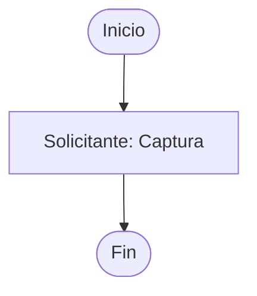

# Fase 1 — Robustez del extractor y clasificación de huecos · Plan de implementación

> **For agentic workers:** REQUIRED SUB-SKILL: Use superpowers:subagent-driven-development (recommended) or superpowers:executing-plans to implement this plan task-by-task. Steps use checkbox (`- [ ]`) syntax for tracking.

**Goal:** Que el extractor no pierda insumos por variaciones de nombre y que sus huecos vengan clasificados en tres niveles, visibles en la CLI y en la página `/revisar` de solo lectura.

**Architecture:** Se añade un tipo `Hueco` en `nucleo/` (capa base, sin dependencias hacia arriba). Los tres sub-extractores (`diccionario`, `metadatos`, `mermaid`) y el orquestador `expediente` dejan de acumular strings y acumulan `Hueco`. El buscador de archivos de `expediente` normaliza nombres (causa raíz del TO-BE perdido por el sufijo " 1") y nunca adivina entre varios candidatos. CLI y web solo cambian cómo agrupan y pintan.

**Tech Stack:** Python 3.9+, `dataclasses`, `re`, `unicodedata`, `pytest`, FastAPI (solo el render de `/revisar`).

**Spec:** `planeacion/specs/2026-08-27-fase-1-extractor-robustez-huecos.md`

## Global Constraints

- Python 3.9 compatible: nada de `X | None` en anotaciones, usar `Optional[X]`. `list[X]` sí se permite (el repo ya lo usa).
- Identificadores y nombres de módulo en español sin acentos (`nucleo`, `huecos`). Los textos para el usuario sí llevan acentos.
- Ninguna función de `nucleo/` importa de `compilador`, `validador`, `web` ni `cli`.
- No tocar `nucleo/formato.py`, `compilador/`, `validador/`, ni `SINTAXIS_ESTRICTA` en `nucleo/reglas.py`.
- Los comentarios explican *por qué*, no *qué*.
- Nada se comitea sin que la suite pase: `.venv/bin/pytest -v`.
- No sobrescribir ningún archivo `.gpm` existente.
- Ejecutar con `.venv/bin/pytest` y `.venv/bin/python`, nunca el intérprete global.

---

### Task 1: Tipo `Hueco` en `nucleo/huecos.py`

**Files:**
- Create: `src/gpmc/nucleo/huecos.py`
- Test: `tests/test_huecos.py`

**Interfaces:**
- Consumes: nada (solo stdlib).
- Produces:
  - `NIVELES: tuple` = `("bloqueante", "falta_dato", "por_confirmar")`
  - `@dataclass class Hueco` con campos `nivel: str`, `codigo: str`, `ubicacion: str`, `mensaje: str`, `propuesta: Optional[str] = None`
  - `Hueco.__str__() -> str` con formato `"[CODIGO] ubicacion: mensaje"` (sin `ubicacion:` si está vacía; sin `[CODIGO] ` si está vacío)
  - `ORDEN_NIVEL: dict` = `{"bloqueante": 0, "falta_dato": 1, "por_confirmar": 2}` para ordenar listas de huecos.

- [ ] **Step 1: Write the failing test**

```python
# tests/test_huecos.py
from gpmc.nucleo.huecos import Hueco, NIVELES, ORDEN_NIVEL


def test_niveles_son_los_tres_esperados():
    assert NIVELES == ("bloqueante", "falta_dato", "por_confirmar")


def test_str_incluye_codigo_ubicacion_y_mensaje():
    h = Hueco("falta_dato", "META-01", "metadatos", "no se encontró el tiempo de respuesta")
    assert str(h) == "[META-01] metadatos: no se encontró el tiempo de respuesta"


def test_str_omite_ubicacion_vacia():
    h = Hueco("bloqueante", "INS-01", "", "no se encontró la Propuesta TO-BE")
    assert str(h) == "[INS-01] no se encontró la Propuesta TO-BE"


def test_propuesta_por_defecto_es_none():
    h = Hueco("por_confirmar", "DIC-01", "p1", "'CURP' sin nombre técnico")
    assert h.propuesta is None


def test_orden_nivel_prioriza_bloqueante():
    huecos = [
        Hueco("por_confirmar", "DIC-01", "p1", "x"),
        Hueco("bloqueante", "INS-01", "", "y"),
        Hueco("falta_dato", "META-01", "", "z"),
    ]
    huecos.sort(key=lambda h: ORDEN_NIVEL[h.nivel])
    assert [h.nivel for h in huecos] == ["bloqueante", "falta_dato", "por_confirmar"]
```

- [ ] **Step 2: Run test to verify it fails**

Run: `.venv/bin/pytest tests/test_huecos.py -v`
Expected: FAIL — `ModuleNotFoundError: No module named 'gpmc.nucleo.huecos'`

- [ ] **Step 3: Write minimal implementation**

```python
# src/gpmc/nucleo/huecos.py
"""Hueco: lo que el extractor no pudo derivar de los insumos, dicho en voz alta.

Distinto de validador.reglas.Hallazgo: aquel describe defectos estructurales de
un .gpm ya compilado; este describe faltantes en la materia prima (AS-IS, TO-BE,
Diccionario) que una persona debe resolver antes de compilar.
"""

from dataclasses import dataclass
from typing import Optional

# El orden es deliberado: de lo que impide compilar a lo que solo conviene mirar.
NIVELES = ("bloqueante", "falta_dato", "por_confirmar")
ORDEN_NIVEL = {nivel: i for i, nivel in enumerate(NIVELES)}


@dataclass
class Hueco:
    nivel: str            # uno de NIVELES
    codigo: str           # estable: INS-01, DIC-01, META-01, FLU-01, MMD-01, ...
    ubicacion: str        # "p1", "flujo", "metadatos", "" (vacío = general)
    mensaje: str          # texto para una persona, con acentos
    propuesta: Optional[str] = None   # valor que el extractor sugirió (DIC-01)

    def __str__(self) -> str:
        pre = f"[{self.codigo}] " if self.codigo else ""
        loc = f"{self.ubicacion}: " if self.ubicacion else ""
        return f"{pre}{loc}{self.mensaje}"
```

- [ ] **Step 4: Run test to verify it passes**

Run: `.venv/bin/pytest tests/test_huecos.py -v`
Expected: PASS (5 passed)

- [ ] **Step 5: Commit**

```bash
git add src/gpmc/nucleo/huecos.py tests/test_huecos.py
git commit -m "feat: tipo Hueco con tres niveles en nucleo"
```

---

### Task 2: `extractores/diccionario.py` emite `Hueco`

**Files:**
- Modify: `src/gpmc/extractores/diccionario.py` (`Resultado.huecos` en línea 64; los `r.huecos.append(...)` en líneas ~136, ~170-173, ~181-184, ~210-213, ~252)
- Test: `tests/test_extractor_diccionario.py` (líneas 78-87 y el resto)

**Interfaces:**
- Consumes: `from gpmc.nucleo.huecos import Hueco` (de Task 1).
- Produces: `diccionario.extraer(texto) -> Resultado` con `Resultado.huecos: list[Hueco]`. Códigos que emite:
  - `DIC-01` — `nivel="por_confirmar"`, `ubicacion=pantalla.id`, `propuesta=<nombre sugerido>` — un campo sin `@@nombre` en su descripción.
  - `DIC-02` — `nivel="falta_dato"`, `ubicacion=pantalla.id` — catálogo declarado como pendiente.
  - `DIC-03` — `nivel="falta_dato"`, `ubicacion=pantalla.id` — la pantalla no trae tabla de campos legible.
  - `DIC-04` — `nivel="falta_dato"`, `ubicacion=""` — no se encontró ninguna cabecera `### Pantalla N`, se agrupó todo en una pantalla.

- [ ] **Step 1: Write the failing test**

Reemplaza las dos pruebas existentes (líneas 78-87) y añade dos más:

```python
# tests/test_extractor_diccionario.py  (reemplaza test_reporta_hueco_si_un_campo_no_trae_nombre_tecnico
#  y test_reporta_hueco_si_el_catalogo_esta_pendiente)
from gpmc.nucleo.huecos import Hueco


def test_reporta_hueco_si_un_campo_no_trae_nombre_tecnico():
    r = ext.extraer(_DICC_SIN_NOMBRE_TECNICO)   # el mismo fixture que ya usaba la prueba
    dic01 = [h for h in r.huecos if h.codigo == "DIC-01"]
    assert dic01, r.huecos
    assert dic01[0].nivel == "por_confirmar"
    assert dic01[0].propuesta            # trae el nombre sugerido
    assert dic01[0].ubicacion.startswith("p")


def test_reporta_hueco_si_el_catalogo_esta_pendiente():
    r = ext.extraer(_DICC_CATALOGO_PENDIENTE)   # el mismo fixture que ya usaba la prueba
    dic02 = [h for h in r.huecos if h.codigo == "DIC-02"]
    assert dic02, r.huecos
    assert dic02[0].nivel == "falta_dato"


def test_todos_los_huecos_son_del_tipo_Hueco():
    r = ext.extraer(_DICC_SIN_NOMBRE_TECNICO)
    assert r.huecos
    assert all(isinstance(h, Hueco) for h in r.huecos)
```

> Nota para el implementador: los fixtures `_DICC_SIN_NOMBRE_TECNICO` y `_DICC_CATALOGO_PENDIENTE` son los textos markdown que las dos pruebas originales ya construían inline. Extráelos a constantes de módulo si aún no lo están, sin cambiar su contenido.

- [ ] **Step 2: Run test to verify it fails**

Run: `.venv/bin/pytest tests/test_extractor_diccionario.py -v`
Expected: FAIL — `AttributeError: 'str' object has no attribute 'codigo'`

- [ ] **Step 3: Write minimal implementation**

En `src/gpmc/extractores/diccionario.py`:

1. Import, tras la línea 20:

```python
from gpmc.nucleo.huecos import Hueco
```

2. Línea 64, cambiar la anotación:

```python
    huecos: list[Hueco] = field(default_factory=list)
```

3. Línea ~136 (pantalla sin tabla legible):

```python
            r.huecos.append(Hueco(
                "falta_dato", "DIC-03", pantalla.id,
                "no trae tabla de campos legible",
            ))
```

4. Líneas ~170-173 (campo sin nombre técnico, primer bloque):

```python
                nombre = re.sub(r"[^a-z0-9]+", "_", _babel(etiqueta)).strip("_")[:40]
                r.huecos.append(Hueco(
                    "por_confirmar", "DIC-01", pantalla.id,
                    f"el campo '{etiqueta}' no declara nombre técnico @@ en su "
                    f"descripción; se propuso '{nombre}'",
                    propuesta=nombre,
                ))
```

5. Líneas ~181-184 (catálogo pendiente):

```python
                r.huecos.append(Hueco(
                    "falta_dato", "DIC-02", pantalla.id,
                    f"el catálogo de '{etiqueta}' está declarado como pendiente "
                    f"en el Diccionario; no se emite",
                ))
```

6. Líneas ~210-213 (no se encontró ninguna cabecera de pantalla):

```python
        r.huecos.append(Hueco(
            "falta_dato", "DIC-04", "",
            "no se encontró ninguna cabecera '### Pantalla N — ACTOR — Nombre'; "
            "se agruparon todos los campos en una sola pantalla por defecto",
        ))
```

7. Línea ~252 (campo sin nombre técnico, bloque de fallback de una pantalla):

```python
                    r.huecos.append(Hueco(
                        "por_confirmar", "DIC-01", "p1",
                        f"se propuso el nombre técnico '{nombre}' para '{etiqueta}'",
                        propuesta=nombre,
                    ))
```

- [ ] **Step 4: Run test to verify it passes**

Run: `.venv/bin/pytest tests/test_extractor_diccionario.py -v`
Expected: PASS

- [ ] **Step 5: Commit**

```bash
git add src/gpmc/extractores/diccionario.py tests/test_extractor_diccionario.py
git commit -m "feat: diccionario emite Hueco tipado (DIC-01..04)"
```

---

### Task 3: `extractores/metadatos.py` emite `Hueco`

**Files:**
- Modify: `src/gpmc/extractores/metadatos.py` (`Resultado.huecos` línea 28; appends en líneas 55, 65, 73-75, 82, 90, 97-99)
- Test: `tests/test_extractor_metadatos.py` si existe; si no, añadir aserción en `tests/test_extractor_expediente.py` (ver Task 5). Comprueba primero: `ls tests/test_extractor_metadatos.py`.

**Interfaces:**
- Consumes: `from gpmc.nucleo.huecos import Hueco`.
- Produces: `metadatos.extraer(as_is, to_be="", nombre_carpeta="") -> Resultado` con `huecos: list[Hueco]`. Códigos (todos `ubicacion="metadatos"`):
  - `META-01` — `falta_dato` — tiempo de respuesta no declarado.
  - `META-02` — `falta_dato` — dependencia no encontrada en el frontmatter.
  - `META-03` — `por_confirmar` — costo no declarado; se asume sin costo.
  - `META-04` — `falta_dato` — no se pudo determinar el nombre del trámite.
  - `META-05` — `por_confirmar` — homoclave no encontrada (normal en trámites nuevos).
  - `META-06` — `por_confirmar` — "A quién va dirigido" no encontrado; queda en 'ambas'.

- [ ] **Step 1: Write the failing test**

```python
# tests/test_extractor_metadatos.py  (crear si no existe)
from gpmc.extractores import metadatos as ext
from gpmc.nucleo.huecos import Hueco


_AS_IS_MINIMO = """---
dependencia: Secretaría X
---
# Análisis AS-IS — Trámite de prueba
"""


def test_huecos_son_Hueco_y_traen_codigo_meta():
    r = ext.extraer(_AS_IS_MINIMO)
    assert r.huecos
    assert all(isinstance(h, Hueco) for h in r.huecos)
    codigos = {h.codigo for h in r.huecos}
    assert "META-01" in codigos            # falta el tiempo de respuesta
    assert all(c.startswith("META-") for c in codigos)


def test_tiempo_faltante_es_falta_dato():
    r = ext.extraer(_AS_IS_MINIMO)
    meta01 = [h for h in r.huecos if h.codigo == "META-01"][0]
    assert meta01.nivel == "falta_dato"


def test_costo_faltante_es_por_confirmar():
    r = ext.extraer(_AS_IS_MINIMO)
    meta03 = [h for h in r.huecos if h.codigo == "META-03"][0]
    assert meta03.nivel == "por_confirmar"
```

- [ ] **Step 2: Run test to verify it fails**

Run: `.venv/bin/pytest tests/test_extractor_metadatos.py -v`
Expected: FAIL — `AttributeError: 'str' object has no attribute 'codigo'`

- [ ] **Step 3: Write minimal implementation**

En `src/gpmc/extractores/metadatos.py`:

1. Tras la línea 12: `from gpmc.nucleo.huecos import Hueco`
2. Línea 28: `huecos: list[Hueco] = field(default_factory=list)`
3. Sustituir cada `r.huecos.append("<texto>")` por el `Hueco` correspondiente, conservando el texto actual como `mensaje`:

```python
# línea 55
    r.huecos.append(Hueco("falta_dato", "META-04", "metadatos",
                          "no se pudo determinar el nombre del trámite"))
# línea 65
    r.huecos.append(Hueco("falta_dato", "META-02", "metadatos",
                          "no se encontró la dependencia en el frontmatter del AS-IS"))
# líneas 73-75
    r.huecos.append(Hueco("por_confirmar", "META-05", "metadatos",
                          "no se encontró homoclave; en trámites nuevos es normal, la asigna GPM"))
# línea 82
    r.huecos.append(Hueco("falta_dato", "META-01", "metadatos",
                          "no se encontró el tiempo de respuesta declarado"))
# línea 90
    r.huecos.append(Hueco("por_confirmar", "META-03", "metadatos",
                          "no se encontró el costo declarado; se asume sin costo"))
# líneas 97-99
    r.huecos.append(Hueco("por_confirmar", "META-06", "metadatos",
                          "no se encontró 'A quién va dirigido'; type_of_person queda en 'ambas'"))
```

- [ ] **Step 4: Run test to verify it passes**

Run: `.venv/bin/pytest tests/test_extractor_metadatos.py -v`
Expected: PASS

- [ ] **Step 5: Commit**

```bash
git add src/gpmc/extractores/metadatos.py tests/test_extractor_metadatos.py
git commit -m "feat: metadatos emite Hueco tipado (META-01..06)"
```

---

### Task 4: `extractores/mermaid.py` emite `Hueco`

**Files:**
- Modify: `src/gpmc/extractores/mermaid.py` (`Resultado.huecos` línea 71; appends en líneas 131, 135-137, 139-142)
- Test: `tests/test_extractor_mermaid.py` (líneas 58-65)

**Interfaces:**
- Consumes: `from gpmc.nucleo.huecos import Hueco`.
- Produces: `mermaid.extraer(bloque) -> Resultado` con `huecos: list[Hueco]`. Códigos:
  - `MMD-02` — `falta_dato`, `ubicacion="flujo"` — una arista referencia un nodo no declarado.
  - `MMD-03` — `falta_dato`, `ubicacion=<id del nodo>` — un nodo no declara carril (`:::clase`).
  - `MMD-04` — `falta_dato`, `ubicacion=<id de la compuerta>` — una compuerta no nombra ningún campo `@@`.
  - (`MMD-01` no lo emite este módulo; lo emite `expediente.py`, ver Task 5.)

- [ ] **Step 1: Write the failing test**

Reemplaza las dos pruebas de las líneas 58-65:

```python
# tests/test_extractor_mermaid.py
from gpmc.nucleo.huecos import Hueco


def test_reporta_hueco_cuando_la_compuerta_no_nombra_campo():
    r = ext.extraer(_MMD_COMPUERTA_SIN_CAMPO)   # fixture ya existente en la prueba original
    mmd04 = [h for h in r.huecos if h.codigo == "MMD-04"]
    assert mmd04, r.huecos
    assert mmd04[0].nivel == "falta_dato"


def test_reporta_hueco_cuando_un_nodo_no_declara_carril():
    r = ext.extraer(_MMD_NODO_SIN_CARRIL)       # fixture ya existente en la prueba original
    mmd03 = [h for h in r.huecos if h.codigo == "MMD-03"]
    assert mmd03, r.huecos


def test_todos_los_huecos_de_mermaid_son_Hueco():
    r = ext.extraer(_MMD_NODO_SIN_CARRIL)
    assert all(isinstance(h, Hueco) for h in r.huecos)
```

- [ ] **Step 2: Run test to verify it fails**

Run: `.venv/bin/pytest tests/test_extractor_mermaid.py -v`
Expected: FAIL — `AttributeError: 'str' object has no attribute 'codigo'`

- [ ] **Step 3: Write minimal implementation**

En `src/gpmc/extractores/mermaid.py`:

1. Tras la línea 13: `from gpmc.nucleo.huecos import Hueco`
2. Línea 71: `huecos: list[Hueco] = field(default_factory=list)`
3. Reemplazar los tres appends:

```python
# línea 131
                r.huecos.append(Hueco(
                    "falta_dato", "MMD-02", "flujo",
                    f"la arista {a.de}->{a.a} referencia un nodo no declarado: {extremo}",
                ))
# líneas 135-137
            r.huecos.append(Hueco(
                "falta_dato", "MMD-03", n.id,
                "no declara carril (:::clase); no se puede saber qué actor lo ejecuta",
            ))
# líneas 139-142
            r.huecos.append(Hueco(
                "falta_dato", "MMD-04", n.id,
                f"la compuerta ({n.texto[:50]}) no nombra ningún campo @@; "
                "la condición debe capturarse a mano",
            ))
```

- [ ] **Step 4: Run test to verify it passes**

Run: `.venv/bin/pytest tests/test_extractor_mermaid.py -v`
Expected: PASS

- [ ] **Step 5: Commit**

```bash
git add src/gpmc/extractores/mermaid.py tests/test_extractor_mermaid.py
git commit -m "feat: mermaid emite Hueco tipado (MMD-02..04)"
```

---

### Task 5: `extractores/expediente.py` — buscador normalizado y huecos tipados

**Files:**
- Modify: `src/gpmc/extractores/expediente.py` (todo `_leer`, líneas 34-66; `Resultado.huecos` línea 25; el cuerpo de `extraer_expediente`, líneas 69-154)
- Test: `tests/test_extractor_expediente.py`

**Interfaces:**
- Consumes: `Hueco` (Task 1); `diccionario`/`metadatos`/`mermaid` ya devuelven `list[Hueco]` (Tasks 2-4).
- Produces: `extraer_expediente(carpeta) -> Resultado` con `Resultado.huecos: list[Hueco]`. Función nueva `_normalizar(nombre: str) -> str`. Función nueva `_buscar_insumo(carpeta: Path, claves: list[str]) -> tuple[Optional[Path], list[Hueco]]`. Códigos nuevos que nacen aquí:
  - `INS-01` — `bloqueante`, `ubicacion=""` — Propuesta TO-BE no encontrada.
  - `INS-02` — `falta_dato`, `ubicacion=""` — varios candidatos `.md` para un insumo; no se elige.
  - `INS-03` — `bloqueante`, `ubicacion=""` — Diccionario de Datos no encontrado.
  - `DIC-00` — `bloqueante`, `ubicacion=""` — no se extrajo ninguna pantalla del Diccionario.
  - `FLU-01` — `falta_dato`, `ubicacion="flujo"` — el TO-BE tiene N compuertas que el manifiesto lineal no ramifica.
  - `FLU-02` — `falta_dato`, `ubicacion="flujo"` — nº de tareas del diagrama ≠ nº de pantallas del Diccionario.
  - `MMD-01` — `falta_dato`, `ubicacion="flujo"` — la Propuesta TO-BE no trae bloque ```mermaid```.

- [ ] **Step 1: Write the failing tests**

Añade a `tests/test_extractor_expediente.py`. Helper para armar un expediente mínimo que compile:

```python
_DICC_MINIMO = """### Pantalla 1 — Solicitante — Datos

| Nombre del Campo | Tipo de Dato | Componente Sugerido (GPM) | Obligatorio | Descripcion |
| CURP | Texto | Input de texto | Sí | La CURP del solicitante @@curp |
"""
_TOBE_MINIMO = """# Propuesta TO-BE


"""


def _expediente(tmp_path, **archivos):
    """archivos: nombre_de_archivo -> contenido. Crea la carpeta y los escribe."""
    carpeta = tmp_path / "exp"
    carpeta.mkdir()
    for nombre, contenido in archivos.items():
        (carpeta / nombre).write_text(contenido, encoding="utf-8")
    return carpeta


def test_encuentra_el_tobe_pese_al_sufijo_uno(tmp_path):
    carpeta = _expediente(
        tmp_path,
        **{"5.-Diccionario de Datos.md": _DICC_MINIMO,
           "3.-Propuesta TO-BE 1.md": _TOBE_MINIMO},
    )
    r = extraer_expediente(carpeta)
    assert not [h for h in r.huecos if h.codigo == "INS-01"], \
        f"no debió reportar TO-BE faltante: {[str(h) for h in r.huecos]}"
    assert r.manifiesto is not None


@pytest.mark.parametrize("nombre_tobe", [
    "Propuesta TO-BE final.md", "propuesta_to_be_v2.md", "TO BE.md",
])
def test_encuentra_insumos_con_acentos_mayusculas_y_version(tmp_path, nombre_tobe):
    base = tmp_path / "c"
    base.mkdir()
    (base / "5.-Diccionario de Datos.md").write_text(_DICC_MINIMO, encoding="utf-8")
    (base / nombre_tobe).write_text(_TOBE_MINIMO, encoding="utf-8")
    r = extraer_expediente(base)
    assert not [h for h in r.huecos if h.codigo == "INS-01"], nombre_tobe


def test_dos_candidatos_de_tobe_no_adivina(tmp_path):
    carpeta = _expediente(
        tmp_path,
        **{"5.-Diccionario de Datos.md": _DICC_MINIMO,
           "Propuesta TO-BE.md": _TOBE_MINIMO,
           "TO-BE borrador.md": _TOBE_MINIMO},
    )
    r = extraer_expediente(carpeta)
    ins02 = [h for h in r.huecos if h.codigo == "INS-02"]
    assert ins02, [str(h) for h in r.huecos]
    assert ins02[0].nivel == "falta_dato"
    # y al no elegir, el flujo se comporta como si faltara: INS-01 bloqueante
    assert any(h.codigo == "INS-01" for h in r.huecos)


def test_sin_tobe_reporta_bloqueante_pero_produce_manifiesto(tmp_path):
    carpeta = _expediente(tmp_path, **{"5.-Diccionario de Datos.md": _DICC_MINIMO})
    r = extraer_expediente(carpeta)
    ins01 = [h for h in r.huecos if h.codigo == "INS-01"]
    assert ins01 and ins01[0].nivel == "bloqueante"
    assert r.manifiesto is not None            # flujo lineal


def test_ignora_pdfs_como_candidatos(tmp_path):
    carpeta = _expediente(
        tmp_path,
        **{"5.-Diccionario de Datos.md": _DICC_MINIMO,
           "Propuesta TO-BE.md": _TOBE_MINIMO},
    )
    (carpeta / "2.-Propuesta TO-BE escaneada.pdf").write_bytes(b"%PDF-1.4 ...")
    r = extraer_expediente(carpeta)
    assert not [h for h in r.huecos if h.codigo == "INS-02"]   # el pdf no cuenta


def test_normalizar_quita_prefijo_sufijo_y_acentos(tmp_path):
    from gpmc.extractores.expediente import _normalizar
    assert _normalizar("3.-Propuesta TO-BE 1.md") == _normalizar("propuesta to be")
    assert _normalizar("1.- Análisis AS-IS.md") == _normalizar("analisis as is")
    assert _normalizar("Diccionario_de_Datos (2).md") == _normalizar("diccionario de datos")


def test_todos_los_huecos_del_expediente_son_Hueco(tmp_path):
    from gpmc.nucleo.huecos import Hueco
    carpeta = _expediente(tmp_path, **{"5.-Diccionario de Datos.md": _DICC_MINIMO})
    r = extraer_expediente(carpeta)
    assert all(isinstance(h, Hueco) for h in r.huecos)
```

Además, **actualiza** las pruebas existentes del archivo que hacen `for h in r.huecos` esperando strings:
- Línea 24: `f"...huecos: {r.huecos[:5]}"` → `f"...huecos: {[str(h) for h in r.huecos][:5]}"`
- Línea 57: `assert r.huecos` (sigue igual)
- Línea 64: `assert any("Diccionario" in h for h in r.huecos)` → `assert any("Diccionario" in str(h) for h in r.huecos)`
- Línea 68 (`test_falla_con_gracia_si_falta_un_insumo`): `assert any("Diccionario" in h for h in r.huecos)` → `assert any(h.codigo == "INS-03" for h in r.huecos)`

- [ ] **Step 2: Run tests to verify they fail**

Run: `.venv/bin/pytest tests/test_extractor_expediente.py -v`
Expected: FAIL — los casos nuevos fallan porque `_normalizar` no existe y `INS-01/02` aún no se emiten; el TO-BE con sufijo " 1" no se encuentra.

- [ ] **Step 3: Write the implementation**

En `src/gpmc/extractores/expediente.py`:

1. Imports (tras la línea 10):

```python
import unicodedata
from gpmc.nucleo.huecos import Hueco
```

2. Línea 25: `huecos: list[Hueco] = field(default_factory=list)`

3. Reemplazar `_leer` (líneas 34-66) por normalización + búsqueda. La lectura de texto y el manejo de `SinPermiso` se conservan:

```python
def _normalizar(nombre: str) -> str:
    """Nombre de archivo -> forma canónica para comparar. Quita acentos, el
    prefijo de orden ('1.-', '3) '), y sufijos de versión/copia (' 1', ' v2',
    ' (2)', ' final', ' copia'). Sin esto, 'Propuesta TO-BE 1.md' no casaba
    con 'Propuesta TO-BE' porque la comparación incluía la extensión."""
    t = unicodedata.normalize("NFKD", nombre or "")
    t = "".join(c for c in t if unicodedata.category(c) != "Mn").lower()
    t = re.sub(r"\.md$", "", t)
    t = re.sub(r"[\s._\-]+", " ", t).strip()
    t = re.sub(r"^\d+\s*[.)\-]+\s*", "", t)               # prefijo de orden
    for _ in range(3):                                     # sufijos, posiblemente apilados
        nuevo = re.sub(r"\s*(v?\d+|final|copia|\(\d+\))$", "", t).strip()
        if nuevo == t:
            break
        t = nuevo
    return t


def _buscar_insumo(carpeta: Path, claves: list[str]):
    """Devuelve (ruta_o_None, huecos). Solo considera archivos .md. Si varios
    casan, no adivina: devuelve None y un hueco INS-02."""
    claves_norm = [_normalizar(k) for k in claves]
    candidatos = []
    for archivo in sorted(carpeta.iterdir()):
        if not archivo.is_file() or archivo.suffix.lower() != ".md":
            continue
        stem = _normalizar(archivo.name)
        if any(k in stem for k in claves_norm):
            candidatos.append(archivo)
    if not candidatos:
        return None, []
    if len(candidatos) > 1:
        nombres = ", ".join(a.name for a in candidatos)
        return None, [Hueco(
            "falta_dato", "INS-02", "",
            f"{len(candidatos)} candidatos para '{claves[0]}': {nombres} — confirma cuál",
        )]
    return candidatos[0], []


def _leer(ruta: Path) -> str:
    """Lee el archivo ya resuelto. SinPermiso traduce el bloqueo de TCC de
    macOS a algo accionable para un analista."""
    try:
        return ruta.read_text(encoding="utf-8")
    except PermissionError as exc:
        raise SinPermiso(
            f"macOS no permite leer '{ruta}'.\n\n"
            "El archivo existe, pero el sistema bloquea el acceso a las carpetas "
            "Documentos, Escritorio y Descargas.\n\n"
            "Solucion: Ajustes del Sistema > Privacidad y seguridad > Acceso total al "
            "disco, y autorizar la aplicacion desde la que se ejecuta (Terminal, o el "
            "navegador si se usa el asistente web).\n\n"
            "Alternativa: mover el expediente a una carpeta fuera de esas tres."
        ) from exc
```

4. En `extraer_expediente`, reemplazar las líneas 73-81 (búsqueda de los tres insumos y sus dos huecos de faltante):

```python
    ruta_as_is, h_as_is = _buscar_insumo(carpeta, ["Análisis AS-IS", "AS IS"])
    ruta_to_be, h_to_be = _buscar_insumo(carpeta, ["Propuesta TO-BE", "TO BE"])
    ruta_dicc, h_dicc = _buscar_insumo(carpeta, ["Diccionario de Datos", "Diccionario"])
    r.huecos += h_as_is + h_to_be + h_dicc

    as_is = _leer(ruta_as_is) if ruta_as_is else ""
    to_be = _leer(ruta_to_be) if ruta_to_be else ""
    dicc = _leer(ruta_dicc) if ruta_dicc else ""

    if not dicc:
        r.huecos.append(Hueco(
            "bloqueante", "INS-03", "",
            "no se encontró el Diccionario de Datos: sin él no hay pantallas",
        ))
        return r
    if not to_be:
        r.huecos.append(Hueco(
            "bloqueante", "INS-01", "",
            "no se encontró la Propuesta TO-BE: el flujo sale lineal, sin ramificar",
        ))
```

5. Línea ~91 — quitar el prefijo de string, ya vienen tipados:

```python
    rd = ext_dicc.extraer(dicc)
    r.huecos += rd.huecos
```

6. Líneas ~92-94 — la pantalla vacía pasa a `DIC-00`:

```python
    if not rd.pantallas:
        r.huecos.append(Hueco(
            "bloqueante", "DIC-00", "",
            "no se extrajo ninguna pantalla del Diccionario",
        ))
        return r
```

7. Línea ~84 — metadatos, quitar prefijo:

```python
    r.huecos += meta.huecos
```

8. Líneas ~126-145 — el bloque del diagrama Mermaid. Quitar el prefijo `[mermaid]` (línea 130 → `r.huecos += rm.huecos`) y tipar los tres huecos de flujo:

```python
    if to_be:
        bloques = _BLOQUE_MERMAID.findall(to_be)
        if bloques:
            rm = ext_mmd.extraer(bloques[0])
            r.huecos += rm.huecos
            compuertas = [n for n in rm.nodos if n.clase_nodo == "compuerta"]
            if compuertas:
                r.huecos.append(Hueco(
                    "falta_dato", "FLU-01", "flujo",
                    f"el diagrama TO-BE tiene {len(compuertas)} compuertas que este "
                    f"manifiesto NO reproduce: el flujo propuesto es lineal, pantalla "
                    f"por pantalla. Revisar y ramificar a mano antes de compilar.",
                ))
            tareas_mmd = [n for n in rm.nodos if n.clase_nodo == "tarea"]
            if len(tareas_mmd) != len(pantallas):
                r.huecos.append(Hueco(
                    "falta_dato", "FLU-02", "flujo",
                    f"el diagrama tiene {len(tareas_mmd)} tareas y el Diccionario "
                    f"{len(pantallas)} pantallas; confirmar la correspondencia",
                ))
        else:
            r.huecos.append(Hueco(
                "falta_dato", "MMD-01", "flujo",
                "la Propuesta TO-BE no trae bloque ```mermaid```",
            ))
```

> El resto de `extraer_expediente` (construcción de actores, pantallas, tareas, conexiones, manifiesto) no cambia.

- [ ] **Step 4: Run tests to verify they pass**

Run: `.venv/bin/pytest tests/test_extractor_expediente.py -v`
Expected: PASS (incluidas las pruebas nuevas y las actualizadas)

- [ ] **Step 5: Run the full extractor slice**

Run: `.venv/bin/pytest tests/test_extractor_diccionario.py tests/test_extractor_metadatos.py tests/test_extractor_mermaid.py tests/test_extractor_expediente.py tests/test_huecos.py -v`
Expected: PASS

- [ ] **Step 6: Verify against real material**

```bash
.venv/bin/python - <<'PY'
import zipfile, pathlib
src = "/Users/danielhernandezrubio/Downloads/Alta de Avisos de Testamento-20260826T193032Z-1-001.zip"
dst = pathlib.Path("scratch/exp_testamento")
with zipfile.ZipFile(src) as z:
    for info in z.infolist():
        raw = info.filename.encode("cp437") if not (info.flag_bits & 0x800) else info.filename.encode("utf-8")
        t = dst / raw.decode("utf-8", "replace")
        if info.is_dir(): t.mkdir(parents=True, exist_ok=True); continue
        t.parent.mkdir(parents=True, exist_ok=True); t.write_bytes(z.read(info))
PY
.venv/bin/gpmc extraer "scratch/exp_testamento/Alta de Avisos de Testamento" -o scratch/testamento.yaml
```

Expected: la línea `[INS-01] ... Propuesta TO-BE` **no** aparece (el archivo `3.-Propuesta TO-BE 1.md` ahora se encuentra). Los ~47 huecos de nombre técnico son `DIC-01`. `scratch/` no se comitea (Task 8).

- [ ] **Step 7: Commit**

```bash
git add src/gpmc/extractores/expediente.py tests/test_extractor_expediente.py
git commit -m "feat: buscador de insumos normalizado y huecos tipados en expediente (INS-01..03, FLU-01/02, DIC-00, MMD-01)"
```

---

### Task 6: `cli.py` — salida agrupada por nivel y bandera `--huecos`

**Files:**
- Modify: `src/gpmc/cli.py` (parser de `extraer`, ~línea 58-60; handler `if args.orden == "extraer"`, líneas ~114-140)
- Test: `tests/test_cli.py` (comprueba primero que existe: `ls tests/test_cli.py`; si no, créalo)

**Interfaces:**
- Consumes: `extraer_expediente(...)` con `Resultado.huecos: list[Hueco]`; `from gpmc.nucleo.huecos import ORDEN_NIVEL`.
- Produces: función `_imprimir_huecos(huecos: list[Hueco], completo: bool) -> None`. El código de salida de `extraer` sigue siendo `0` con manifiesto producido, `2` sin él.

- [ ] **Step 1: Write the failing test**

```python
# tests/test_cli.py  (añadir; crear el archivo si no existe con los imports)
import pathlib
from gpmc.cli import main

_DICC = """### Pantalla 1 — Solicitante — Datos

| Nombre del Campo | Tipo de Dato | Componente Sugerido (GPM) | Obligatorio | Descripcion |
| CURP | Texto | Input | Sí | La CURP @@curp |
| Nombre | Texto | Input | Sí | El nombre del solicitante |
"""


def _exp(tmp_path):
    c = tmp_path / "exp"; c.mkdir()
    (c / "5.-Diccionario de Datos.md").write_text(_DICC, encoding="utf-8")
    return c


def test_extraer_agrupa_huecos_por_nivel(tmp_path, capsys):
    salida = tmp_path / "t.yaml"
    codigo = main(["extraer", str(_exp(tmp_path)), "-o", str(salida)])
    out = capsys.readouterr().out
    assert codigo == 0
    assert "BLOQUEANTE" in out            # falta TO-BE
    assert "POR CONFIRMAR" in out         # 'Nombre' sin @@
    assert "[INS-01]" in out


def test_bandera_huecos_no_trunca(tmp_path, capsys):
    # Diccionario con muchos campos sin @@ para forzar truncado por defecto
    filas = "\n".join(
        f"| Campo {i} | Texto | Input | No | sin nombre tecnico |" for i in range(10)
    )
    dicc = ("### Pantalla 1 — Solicitante — Datos\n\n"
            "| Nombre del Campo | Tipo de Dato | Componente Sugerido (GPM) | Obligatorio | Descripcion |\n"
            + filas + "\n")
    c = tmp_path / "exp"; c.mkdir()
    (c / "5.-Diccionario de Datos.md").write_text(dicc, encoding="utf-8")
    salida = tmp_path / "t.yaml"

    main(["extraer", str(c), "-o", str(salida)])
    truncado = capsys.readouterr().out
    assert "y " in truncado and "más" in truncado          # se truncó

    main(["extraer", str(c), "-o", str(salida), "--huecos"])
    completo = capsys.readouterr().out
    assert "más" not in completo.split("POR CONFIRMAR")[1]  # ya no trunca
```

- [ ] **Step 2: Run test to verify it fails**

Run: `.venv/bin/pytest tests/test_cli.py -v`
Expected: FAIL — la salida actual dice "hueco(s) que una persona debe resolver", no "BLOQUEANTE".

- [ ] **Step 3: Write the implementation**

En `src/gpmc/cli.py`:

1. Import junto a los demás: `from gpmc.nucleo.huecos import ORDEN_NIVEL`
2. Parser de `extraer` (tras `e.add_argument("-o", ...)`):

```python
    e.add_argument("--huecos", "-H", action="store_true",
                   help="lista todos los huecos sin truncar")
```

3. Función auxiliar a nivel de módulo (junto a `_imprimir`):

```python
_ROTULO = {
    "bloqueante": ("■", "BLOQUEANTE", "resolver antes de compilar"),
    "falta_dato": ("▲", "FALTAN DATOS", "un humano debe escribirlos"),
    "por_confirmar": ("·", "POR CONFIRMAR", "el extractor propuso un valor, revísalos de un vistazo"),
}


def _imprimir_huecos(huecos, completo: bool) -> None:
    for nivel in ("bloqueante", "falta_dato", "por_confirmar"):
        grupo = [h for h in huecos if h.nivel == nivel]
        if not grupo:
            continue
        glifo, titulo, nota = _ROTULO[nivel]
        print(f"\n{glifo} {len(grupo)} {titulo} — {nota}")
        limite = len(grupo) if (completo or nivel != "por_confirmar") else 3
        for h in grupo[:limite]:
            loc = f"{h.ubicacion} " if h.ubicacion else ""
            flecha = f" → {h.propuesta}" if h.propuesta else ""
            print(f"  [{h.codigo}] {loc}{h.mensaje}{flecha}")
        if len(grupo) > limite:
            print(f"  … y {len(grupo) - limite} más   (usa --huecos para verlos todos)")
```

4. En el handler `if args.orden == "extraer":`, sustituir el bloque `if r.huecos: ...` (líneas ~131-139) por:

```python
        if r.huecos:
            _imprimir_huecos(r.huecos, args.huecos)
        return 0
```

- [ ] **Step 4: Run test to verify it passes**

Run: `.venv/bin/pytest tests/test_cli.py -v`
Expected: PASS

- [ ] **Step 5: Commit**

```bash
git add src/gpmc/cli.py tests/test_cli.py
git commit -m "feat: gpmc extraer agrupa huecos por nivel y acepta --huecos"
```

---

### Task 7: web — `huecos.json` y la página `/revisar` con tres bloques plegables

**Files:**
- Modify: `src/gpmc/web/app.py` (líneas 60-98: rutas `/extraer` y `/revisar/{sid}`)
- Modify: `src/gpmc/web/plantillas.py` (`revision`, líneas ~93-160; y el CSS de `.huecos`, líneas ~39-42)
- Test: `tests/test_web.py` (línea 47, `test_el_paso_de_revision_muestra_huecos_y_pantallas`)

**Interfaces:**
- Consumes: `Resultado.huecos: list[Hueco]`; `from gpmc.nucleo.huecos import Hueco, ORDEN_NIVEL`.
- Produces: en disco, `<sid>/huecos.json` = `[{"nivel","codigo","ubicacion","mensaje","propuesta"}, ...]`. `plantillas.revision(m, huecos, problemas, estimacion, sid)` sigue con la misma firma; `huecos` ahora es `list[Hueco]`.

- [ ] **Step 1: Write the failing test**

```python
# tests/test_web.py — reemplaza test_el_paso_de_revision_muestra_huecos_y_pantallas
def test_el_paso_de_revision_agrupa_huecos_por_nivel(cliente):
    # 'cliente' sube los insumos de prueba tal como ya lo hace la prueba original.
    r = _subir_insumos_de_prueba(cliente)          # helper ya existente en el archivo
    assert r.status_code == 200
    texto = r.text.lower()
    assert "por confirmar" in texto
    assert "bloqueante" in texto or "faltan datos" in texto
    assert "<details" in r.text                    # bloques plegables
```

> Si el archivo no tiene un helper `_subir_insumos_de_prueba`, reutiliza el cuerpo de la prueba original (que ya hace el POST a `/extraer` y sigue el redirect a `/revisar`).

- [ ] **Step 2: Run test to verify it fails**

Run: `.venv/bin/pytest tests/test_web.py -v`
Expected: FAIL — no hay `<details>` ni el rótulo "por confirmar".

- [ ] **Step 3: Write the implementation**

En `src/gpmc/web/app.py`:

1. Imports: `import json` y `from gpmc.nucleo.huecos import Hueco`
2. Ruta `POST /extraer`, sustituir la línea 87 (`(carpeta / "huecos.txt").write_text(...)`):

```python
        huecos_serializables = [
            {"nivel": h.nivel, "codigo": h.codigo, "ubicacion": h.ubicacion,
             "mensaje": h.mensaje, "propuesta": h.propuesta}
            for h in r.huecos
        ]
        (carpeta / "huecos.json").write_text(
            json.dumps(huecos_serializables, ensure_ascii=False), encoding="utf-8"
        )
```

3. Ruta `GET /revisar/{sid}`, sustituir las líneas 96-97 (`crudo = ...; huecos = ...`):

```python
        datos = json.loads((carpeta / "huecos.json").read_text(encoding="utf-8"))
        huecos = [Hueco(**d) for d in datos]
```

En `src/gpmc/web/plantillas.py`:

4. En `revision`, sustituir el bloque `bloque_huecos` (líneas ~97-104) por tres `<details>`, uno por nivel:

```python
    _ROTULO = {
        "bloqueante": ("Bloqueante", "resolver antes de compilar", "#c0392b"),
        "falta_dato": ("Faltan datos", "un humano debe escribirlos", "#b9770e"),
        "por_confirmar": ("Por confirmar", "el extractor propuso un valor", "#6b7280"),
    }
    bloque_huecos = ""
    for nivel in ("bloqueante", "falta_dato", "por_confirmar"):
        grupo = [h for h in huecos if h.nivel == nivel]
        if not grupo:
            continue
        titulo, nota, color = _ROTULO[nivel]
        lis = "".join(
            f"<li><code>{e(h.codigo)}</code> "
            f"{(e(h.ubicacion) + ' ') if h.ubicacion else ''}{e(h.mensaje)}"
            f"{(' → <b>' + e(h.propuesta) + '</b>') if h.propuesta else ''}</li>"
            for h in grupo
        )
        abierto = " open" if nivel != "por_confirmar" else ""
        bloque_huecos += (
            f'<details class="huecos"{abierto} style="border-left:4px solid {color}">'
            f'<summary><b>{len(grupo)}</b> {titulo} — {nota}</summary>'
            f"<ul>{lis}</ul></details>"
        )
```

5. CSS (líneas ~39-42): añadir reglas para `details.huecos summary{cursor:pointer;font-size:.95rem}` y conservar el aspecto de `.huecos`.

- [ ] **Step 4: Run test to verify it passes**

Run: `.venv/bin/pytest tests/test_web.py -v`
Expected: PASS

- [ ] **Step 5: Manual smoke check**

```bash
.venv/bin/gpmc servir --puerto 8011 &
sleep 2
# subir los 3 .md del expediente de Testamento por el navegador en http://127.0.0.1:8011
# verificar: tres bloques plegables, "Por confirmar" cerrado, colores por nivel
kill %1
```

- [ ] **Step 6: Commit**

```bash
git add src/gpmc/web/app.py src/gpmc/web/plantillas.py tests/test_web.py
git commit -m "feat: /revisar agrupa huecos en tres bloques plegables; huecos.json en disco"
```

---

### Task 8: Limpieza de repositorio

**Files:**
- Delete: `patch.py`, `patch_dic.py`, `test_acceso.yaml`, `test_tol.yaml`, `scratch/`
- Modify: `.gitignore`
- Revert: cambio sin commitear de `src/gpmc/extractores/expediente.py` (ya subsumido por Task 5 — a estas alturas el archivo está reescrito, así que solo hay que confirmar que no quedan las variantes `AS_IS.md`/`TO_BE.md` sueltas)

**Interfaces:** ninguna.

- [ ] **Step 1: Confirmar que la suite completa pasa antes de limpiar**

Run: `.venv/bin/pytest -v`
Expected: PASS (toda la suite, incluida la de ida y vuelta byte-exacta de `nucleo/formato.py`)

- [ ] **Step 2: Borrar archivos sueltos y actualizar `.gitignore`**

```bash
git rm -f patch.py patch_dic.py test_acceso.yaml test_tol.yaml
rm -rf scratch/
printf 'scratch/\n' >> .gitignore
```

- [ ] **Step 3: Verificar que no quedó basura ni referencias**

```bash
git status
grep -rn "AS_IS.md\|TO_BE.md\|Diccionario_Datos.md" src/ || echo "sin variantes sueltas — ok"
```

Expected: `git status` limpio salvo los borrados y `.gitignore`; el `grep` no encuentra nada.

- [ ] **Step 4: Suite completa una vez más**

Run: `.venv/bin/pytest -v`
Expected: PASS

- [ ] **Step 5: Commit**

```bash
git add -A
git commit -m "chore: elimina scripts y YAML de prueba sueltos; ignora scratch/"
```

---

## Self-Review

**1. Spec coverage:**

| Sección del spec | Task |
|---|---|
| §3.1 buscador normalizado, solo `.md`, ambigüedad → `INS-02` | Task 5 |
| §3.2 tipo `Hueco` en `nucleo/huecos.py` | Task 1 |
| §3.3 sub-extractores devuelven `list[Hueco]`; tabla de códigos | Tasks 2, 3, 4, 5 |
| §3.4 salida CLI agrupada + `--huecos` | Task 6 |
| §3.5 `/revisar` tres bloques plegables; `huecos.json` | Task 7 |
| §3.6 limpieza de repo | Task 8 |
| §4 plan de pruebas (matcher, clasificación, regresión, suite verde) | Tasks 1-8, cada una con su prueba; suite completa en Tasks 5, 8 |
| §6 criterios de aceptación 1-6 | 1→Task 5 step 6; 2→Task 6; 3→Tasks 1-5; 4→Task 7; 5→Task 8; 6→Task 8 |

Sin huecos de cobertura.

**2. Placeholder scan:** El único `TBD`-equivalente del spec ("el detalle exacto lo fija el plan" sobre la firma de `_leer`) queda resuelto en Task 5 step 3 con `_normalizar` + `_buscar_insumo` + `_leer` concretos. Ningún step dice "añade manejo de errores" sin mostrar el código. Los fixtures reutilizados de pruebas existentes se nombran explícitamente con nota al implementador.

**3. Type consistency:**
- `Hueco(nivel, codigo, ubicacion, mensaje, propuesta=None)` — mismo orden posicional en Tasks 1-7.
- `ORDEN_NIVEL` / `NIVELES` — definidos en Task 1, usados en Tasks 6, 7.
- `_normalizar` y `_buscar_insumo` — definidos y usados solo en Task 5; `_buscar_insumo` devuelve `tuple[Optional[Path], list[Hueco]]` de forma consistente.
- `plantillas.revision` — firma intacta; solo cambia el tipo de `huecos` de `list[str]` a `list[Hueco]`, reflejado en Task 7.
- Códigos de hueco: `INS-01/02/03`, `DIC-00/01/02/03/04`, `META-01..06`, `FLU-01/02`, `MMD-01/02/03/04` — sin choques entre tasks.

---

## Execution Handoff

Plan completo y guardado en `planeacion/planes/2026-08-27-fase-1-extractor-huecos.md`. Dos formas de ejecutarlo:

1. **Subagente por tarea (recomendado)** — se despacha un subagente fresco por cada Task, con revisión entre tareas.
2. **En esta sesión** — ejecución por lotes con puntos de control (skill `executing-plans`).
