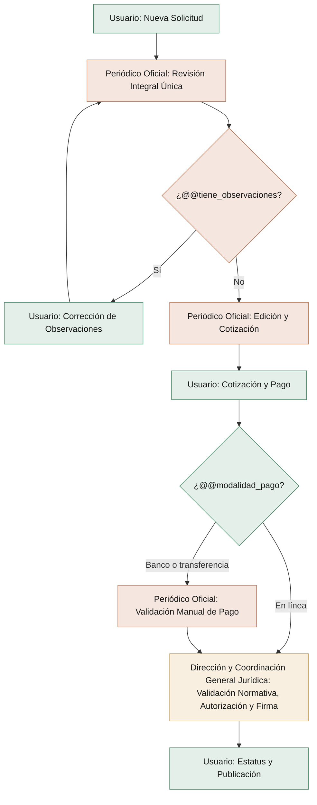

# Ejemplo de escala — Publicación de Avisos Judiciales en el Periódico Oficial

Expediente real del equipo de Simplificación (Periódico Oficial del Estado de Hidalgo), recortado
para mostrar CUÁNTO desglosa el equipo: qué pasos del AS-IS conserva, cuántas pantallas salen y
cómo quedan las compuertas. Es otro trámite: no copies sus campos, sus actores ni sus textos.

## 1. Análisis de eliminación (cada requisito y cada paso del AS-IS, uno por fila)

| Elemento del AS-IS | ¿Se elimina? | Fundamento |
|---|---|---|
| Requisito: archivos digitales editables (Word) y PDF | No, se conservan | Son el documento a publicar; el Periódico Oficial necesita el Word editable para darle formato. |
| Requisito: documento original con firmas autógrafas | Se elimina la entrega física; se conserva su versión escaneada | Sujeto a que la Coordinación General Jurídica confirme que el PDF con firmas escaneadas satisface el art. 15 de la Ley del POEH (ver Pendientes). |
| Requisito: orden de trabajo llenada a mano | Sí | Repetía los datos que el usuario ya captura en el formulario; en el TO-BE es una sola solicitud digital. |
| Requisito: RFC | No | Se necesita para el CFDI de Hacienda. |
| Requisito: correo electrónico | No | Se necesita para el CFDI y para las notificaciones. |
| Llenar el Google Form | Sí | Lo sustituye la solicitud en GPM; deja de existir como sistema paralelo. |
| Agendar cita y acudir a ventanilla a entregar el original | Sí | Consecuencia de recibir el documento digitalizado; sujeto al art. 15. |
| Llenar y firmar a mano la orden de trabajo | Sí | La sustituye la solicitud digital. |
| Revisión de Oficialía de Partes (cotejo digital contra el original) | Se fusiona | Pasa a la revisión integral única. |
| Revisión del Área Jurídica (procedencia y legalidad) | Se fusiona | Pasa a la revisión integral única. |
| Revisión de Control y Seguimiento (clasificar y ordenar la publicación) | Se fusiona | Pasa a la revisión integral única. |
| Revisión de Edición Digital (formato técnico) | Se fusiona | Pasa a la revisión integral única. |
| Ciclos de observaciones por área y oficio de devolución físico | Sí, se sustituyen | Queda un solo ciclo digital con el mismo folio. |
| Editar el documento y determinar las planas | No | Requiere el criterio del personal de edición. |
| Capturar la cotización en Google Drive | Sí | La cotización se registra en GPM. |
| Generar el F7 en e-SIT | No | GPM no puede integrarse con e-SIT; se conserva como tarea manual. Vía de acción: la integración por API queda como fase 2. |
| Entregar el F7 por WhatsApp, correo o en físico | Sí | El usuario lo descarga desde GPM. |
| Verificar el pago consultando e-SIT | No en la modalidad banco o transferencia; sí en la modalidad en línea | En línea lo valida el sistema; en banco o transferencia sigue siendo manual por la misma restricción de integración. |
| Dar de baja el F7 si no se paga | No modelado | El TO-BE actual no dice qué pasa con un F7 sin pago (ver Pendientes). |
| Revisión de la Dirección y validación de la Coordinación General Jurídica | No | Es una atribución legal de la Coordinación. |
| Firma Electrónica Avanzada | No | Ya existe en el AS-IS y se conserva. |
| Publicar en el portal | No | Es el resultado del trámite. |
| Capturar la fecha de publicación en Google Drive | Sí | La fecha queda registrada en GPM. |

## 2. Pantallas del Diccionario (resumen: etiqueta — tipo — @@ — obligatorio — visibilidad — catálogo)

### Pantalla 1 — USUARIO (Plataforma Ciudadano) — Nueva Solicitud
La persona o el juzgado que necesita publicar un documento captura primero su CURP; el sistema autocompleta su nombre y apellidos y ofrece corregirlos si algo no coincide. Después llena su RFC, correo y teléfono de contacto, indica la dependencia o juzgado de origen, el tipo y el nombre del documento y cuántas veces debe publicarse, adjunta el PDF con las firmas autógrafas y el Word editable, y acepta el aviso de privacidad. No puede enviar si falta algún dato o archivo.
- CURP — String — @@curp — Obligatorio: Sí
- Nombre — String — @@nombre — Obligatorio: Sí
- Apellido Paterno — String — @@apellido_paterno — Obligatorio: Sí
- Apellido Materno — String — @@apellido_materno — Obligatorio: No
- ¿Corregir Datos Autocompletados? — Boolean — @@corregir_datos_renapo — Obligatorio: Sí
- RFC — String — @@rfc — Obligatorio: Sí
- Correo Electrónico — String — @@correo — Obligatorio: Sí
- Teléfono de Contacto — String — @@telefono — Obligatorio: Sí
- Dependencia / Juzgado de Origen — String — @@dependencia_origen — Obligatorio: Sí
- Origen del Documento — Select — @@origen_documento — Obligatorio: Sí — Catálogo: Federal · Ejecutivo · Legislativo · Judicial · Municipal · Particular o Descentralizado
- Tipo de Documento a Publicar — Select — @@tipo_documento — Obligatorio: Sí — Catálogo: Edicto · Ley · Decreto · Reglamento · Acuerdo · Convocatoria · Bando de Policía · Aviso Notarial · Circular · Otro
- Nombre del Documento a Publicar — String — @@nombre_documento — Obligatorio: Sí
- Número de Veces a Publicar — Select — @@numero_veces — Obligatorio: Sí — Catálogo: 1 (4 UMA) · 2 (8 UMA) · 3 (12 UMA)
- Documento: PDF con Firmas Autógrafas — String — @@doc_publicar_pdf — Obligatorio: Sí
- Documento: Word Editable — String — @@doc_publicar_word — Obligatorio: Sí
- Acepto el Aviso de Privacidad — Boolean — @@acepta_privacidad — Obligatorio: Sí

### Pantalla 2 — PERIÓDICO OFICIAL — Revisión Integral Única
El personal del Periódico Oficial revisa en un solo paso lo que envió el solicitante: que la documentación esté completa, que proceda legalmente y que el formato técnico sea correcto. Registra si hay observaciones y, si las hay, las escribe para que el solicitante las corrija.
- ¿Tiene Observaciones? — Boolean — @@tiene_observaciones — Obligatorio: Sí
- Observaciones — String — @@observaciones — Obligatorio: Condicional — Visible si "¿Tiene Observaciones?" = Sí

### Pantalla 3 — USUARIO (Plataforma Ciudadano) — Corrección de Observaciones
Cuando la revisión tiene observaciones, el solicitante las lee y vuelve a cargar el PDF y el Word corregidos, conservando el mismo folio.
- Documento: PDF con Firmas Autógrafas Corregido — String — @@doc_pdf_corregido — Obligatorio: Sí
- Documento: Word Editable Corregido — String — @@doc_word_corregido — Obligatorio: Sí

### Pantalla 4 — PERIÓDICO OFICIAL — Edición y Cotización
El Periódico Oficial da formato al documento para su edición, registra cuántas planas ocupa y el monto que corresponde según el número de publicaciones, y sube el formato de pago F7 que generó en el sistema de Hacienda.
- Documento: Versión Editada al Formato del PO — String — @@doc_editado — Obligatorio: Sí
- Planas a Cobrar — Float — @@planas — Obligatorio: Sí
- Monto a Pagar — Float — @@monto — Obligatorio: Sí
- Documento: Formato de Pago F7 — String — @@doc_f7 — Obligatorio: Sí

### Pantalla 5 — USUARIO (Plataforma Ciudadano) — Cotización y Pago
El solicitante ve su cotización, descarga su formato de pago y elige cómo pagar: en línea, o en banco o por transferencia, subiendo en ese caso su comprobante.
- Modalidad de Pago — Select — @@modalidad_pago — Obligatorio: Sí — Catálogo: En línea · Banco o transferencia
- Pago en Línea — Boolean — @@pago_en_linea — Obligatorio: Condicional — Visible si "Modalidad de Pago" = En línea
- Documento: Comprobante de Pago — String — @@comprobante_pago — Obligatorio: Condicional — Visible si "Modalidad de Pago" = Banco o transferencia

### Pantalla 6 — PERIÓDICO OFICIAL — Validación Manual de Pago
Solo cuando el pago fue por banco o transferencia, un funcionario del Periódico Oficial compara el comprobante con el formato de pago y confirma si el pago está validado.
- ¿Pago Validado? — Boolean — @@pago_validado — Obligatorio: Sí

### Pantalla 7 — DIRECCIÓN Y COORDINACIÓN GENERAL JURÍDICA — Validación Normativa, Autorización y Firma
La Dirección y la Coordinación General Jurídica revisan que la edición cumpla la normatividad y, si es así, la autorizan y la firman electrónicamente; con eso el documento se publica.
- ¿Cumple con la Normatividad? — Boolean — @@dictamen_cgj — Obligatorio: Sí
- Autoriza y Firma — Boolean — @@autoriza_firma_fiel — Obligatorio: Sí — Visible si "¿Cumple con la Normatividad?" = Sí
- Nombre del Firmante — String — @@nombre_firmante — Obligatorio: No

### Pantalla 8 — USUARIO (Plataforma Ciudadano) — Estatus y Publicación
El solicitante ve en cualquier momento en qué etapa va su trámite y, cuando se publica, la fecha y la liga para consultar o descargar su ejemplar.
- Estatus del Trámite — Select — @@estatus_tramite — Obligatorio: No — Catálogo: En revisión · En corrección · Pendiente de pago · En edición · Autorizado · Publicado
- Fecha de Publicación — Date — @@fecha_publicacion — Obligatorio: No — Visible si "Estatus del Trámite" = Publicado
- Liga de la Publicación — String — @@liga_publicacion — Obligatorio: No — Visible si "Estatus del Trámite" = Publicado

## 3. Diagrama compilable del TO-BE y tabla Tarea ↔ Pantalla ↔ Actor

| Tarea del diagrama | Pantalla del Diccionario | Actor |
|---|---|---|
| Nueva Solicitud | Pantalla 1 | Usuario (Plataforma Ciudadano) |
| Revisión Integral Única | Pantalla 2 | Periódico Oficial |
| Corrección de Observaciones | Pantalla 3 | Usuario (Plataforma Ciudadano) |
| Edición y Cotización | Pantalla 4 | Periódico Oficial |
| Cotización y Pago | Pantalla 5 | Usuario (Plataforma Ciudadano) |
| Validación Manual de Pago | Pantalla 6 | Periódico Oficial |
| Validación Normativa, Autorización y Firma | Pantalla 7 | Dirección y Coordinación General Jurídica |
| Estatus y Publicación | Pantalla 8 | Usuario (Plataforma Ciudadano) |
